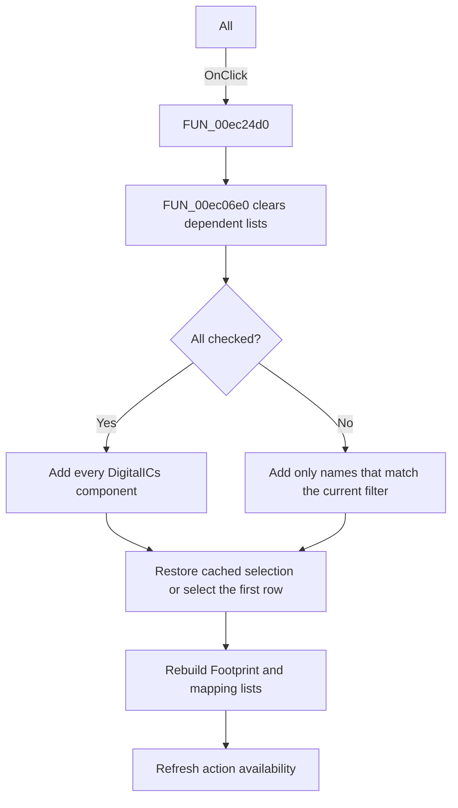

# All

> Analysis status: Source, call-path, state, and error evidence reviewed.

## Control

| Property | Recovered value |
| --- | --- |
| Form | PcbForm4 |
| Component path | PcbForm4.Panel2.cbxShowAllComp |
| Control class | TCheckBox |
| Caption | All |
| Hint | Not present in the recovered resource. |
| Text | Not present in the recovered resource. |
| Handler name | cbxShowAllCompClick |
| Handler address | 00ec24d0 |
| Graph node | `resource:dfm:PcbForm4/PcbForm4.Panel2.cbxShowAllComp` |
| Handler node | `function:00ec24d0` |
| Graph layer | UI |

## What happens when clicked

The click rebuilds the Component list with either all `DigitalICs` components or only components that match the current filter.

The handler copies filter state from form field `+0x890` and calls [`FUN_00ec06e0`](../../../DecompiledSources/Tina16/functions/0000000000EC06E0__FUN_00ec06e0.c). That helper clears the Component, Footprint, and mapping lists, obtains all `DigitalICs` component names from the current library, and branches on this check box. The checked path adds every name. The clear path compares normalized names with the current filter and adds only matches.

After population, the helper restores the cached component selection when it remains available, otherwise selects the first row. It then rebuilds the dependent Footprint and mapping lists. If no component remains, it only refreshes action availability and retains the cached filter state.

## Click flow

## Handler evidence

- Source: [DecompiledSources/Tina16/functions/0000000000EC24D0__FUN_00ec24d0.c](../../../DecompiledSources/Tina16/functions/0000000000EC24D0__FUN_00ec24d0.c)
- Recovered role: Toggles between all components and the current filtered component set.
- Current graph summary: Handles 1 Delphi UI event: PcbForm4.Panel2.cbxShowAllComp.OnClick.
- Current graph behavior: Passes the current filter to FUN_00ec06e0. That helper clears dependent lists, populates all component names when checked or matching names when clear, restores a cached selection or selects the first item, rebuilds footprints and mappings, and refreshes actions.
- Current graph evidence: FUN_00ec24d0 copies field +0x890 and calls FUN_00ec06e0. FUN_00ec06e0 reads the check-box state, enumerates DigitalICs names, has separate all and filtered population branches, restores selection, and calls the dependent-list refresh paths. The caption is All.
- Complexity: complex
- Distinct outgoing calls: 3

## Direct calls

- `function:00414480` — Delphi UnicodeString clear and finalization helper
- `function:00ea9ca0` — FUN_00ea9ca0
- `function:00ec06e0` — FUN_00ec06e0

## Resource evidence

- Kind: Not present in the recovered resource.
- Modal result: Not present in the recovered resource.
- Checked state: Not present in the recovered resource.
- List items: Not present in the recovered resource.
- Image reference: Not present in the recovered resource.
- Extracted glyph: None.

## Nearby label candidates

Nearby labels are layout candidates only. They are not proof of behavior.

- Rank 1: Component list: at distance 351.
- Rank 2: Footprint list: at distance 361.

## No-op and error behavior

- If the selected filter produces no components, the dependent lists remain clear and action availability is refreshed.
- Repeated clicks rebuild the lists even when the resulting set is unchanged.
- The handler has no local backend enumeration recovery.

## Analysis limits

- The Delphi name and exact construction of filter field `+0x890` are not recovered.
- The string matching uses normalized values, but the complete normalization rules are not recovered.
