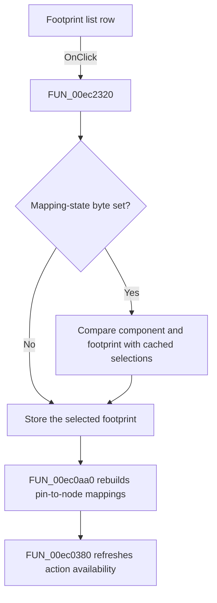

# LbCases

> Analysis status: Source, call-path, state, and error evidence reviewed.

## Control

| Property | Recovered value |
| --- | --- |
| Form | PcbForm4 |
| Component path | PcbForm4.Panel2.LbCases |
| Control class | TListBox |
| Caption | Not present in the recovered resource. |
| Hint | Not present in the recovered resource. |
| Text | Not present in the recovered resource. |
| Handler name | LbCasesClick |
| Handler address | 00ec2320 |
| Graph node | `resource:dfm:PcbForm4/PcbForm4.Panel2.LbCases` |
| Handler node | `function:00ec2320` |
| Graph layer | UI |

## What happens when clicked

Clicking a Footprint list row makes that footprint current and rebuilds its pin-to-node mapping view.

When the form's mapping-state byte is set, the handler compares the current component and footprint selections with cached values at `+0x8a8` and `+0x8a0`. It keeps the state byte set only when both selections are unchanged. It then stores the selected footprint in field `+0x860`, calls [`FUN_00ec0aa0`](../../../DecompiledSources/Tina16/functions/0000000000EC0AA0__FUN_00ec0aa0.c) to parse the selected footprint section and rebuild both mapping lists, and calls [`FUN_00ec0380`](../../../DecompiledSources/Tina16/functions/0000000000EC0380__FUN_00ec0380.c) to refresh action availability.

The nearby `Footprint list:` label agrees with this role. The selection read, cached state, and rebuild calls prove it.

## Click flow

## Handler evidence

- Source: [DecompiledSources/Tina16/functions/0000000000EC2320__FUN_00ec2320.c](../../../DecompiledSources/Tina16/functions/0000000000EC2320__FUN_00ec2320.c)
- Recovered role: Selects a footprint and rebuilds its pin-to-node mapping view.
- Current graph summary: Handles 1 Delphi UI event: PcbForm4.Panel2.LbCases.OnClick.
- Current graph behavior: Reconciles the mapping-state byte with cached component and footprint selections, stores the selected footprint, rebuilds the footprint's mapping lists and derived controls, and refreshes action availability.
- Current graph evidence: FUN_00ec2320 reads the current Component and Footprint list values, compares them with fields +0x8a8 and +0x8a0 when +0x8c0 is set, assigns the selected footprint to +0x860, and calls FUN_00ec0aa0 and FUN_00ec0380. The nearest label is Footprint list.
- Complexity: complex
- Distinct outgoing calls: 6

## Direct calls

- `function:00414560` — Delphi UnicodeString array finalization helper
- `function:00414ad0` — Delphi UnicodeString assignment helper
- `function:00416db0` — FUN_00416db0
- `function:00ea9ca0` — FUN_00ea9ca0
- `function:00ec0380` — FUN_00ec0380
- `function:00ec0aa0` — FUN_00ec0aa0

## Resource evidence

- Kind: Not present in the recovered resource.
- Modal result: Not present in the recovered resource.
- Checked state: Not present in the recovered resource.
- List items: Not present in the recovered resource.
- Image reference: Not present in the recovered resource.
- Extracted glyph: None.

## Nearby label candidates

Nearby labels are layout candidates only. They are not proof of behavior.

- Rank 1: Footprint list: at distance 22.
- Rank 2: Component list: at distance 192.

## No-op and error behavior

- The click always runs the mapping and action refresh for the current selection.
- A changed component or footprint clears the retained mapping-state flag before rebuild.
- The handler has no local invalid-index or backend error recovery; normal list interaction supplies a selected row.

## Analysis limits

- The Delphi names for cached fields `+0x8a0`, `+0x8a8`, and state byte `+0x8c0` are not recovered.
