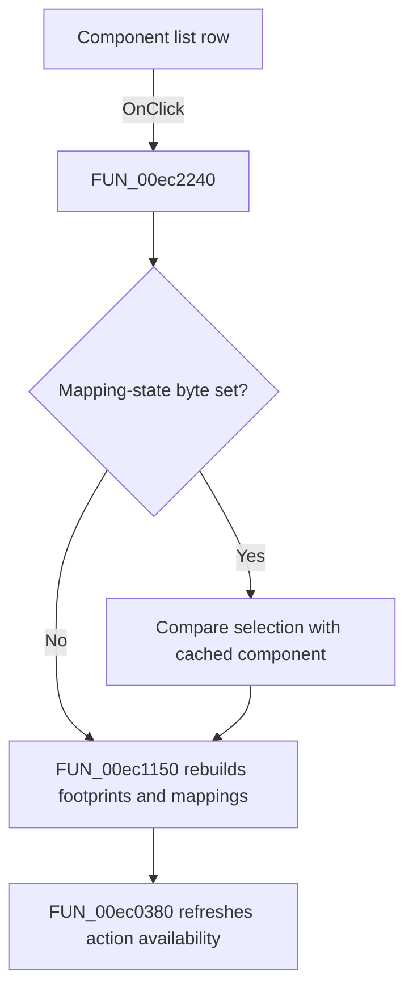

# LbComponents

> Analysis status: Source, call-path, state, and error evidence reviewed.

## Control

| Property | Recovered value |
| --- | --- |
| Form | PcbForm4 |
| Component path | PcbForm4.Panel2.LbComponents |
| Control class | TListBox |
| Caption | Not present in the recovered resource. |
| Hint | Not present in the recovered resource. |
| Text | Not present in the recovered resource. |
| Handler name | LbComponentsClick |
| Handler address | 00ec2240 |
| Graph node | `resource:dfm:PcbForm4/PcbForm4.Panel2.LbComponents` |
| Handler node | `function:00ec2240` |
| Graph layer | UI |

## What happens when clicked

Clicking a Component list row makes that component current and rebuilds its dependent Footprint and mapping lists.

When the mapping-state byte at `+0x8c0` is set, the handler compares the selected component with cached component field `+0x8a8` and retains the byte only when they match. It then calls [`FUN_00ec1150`](../../../DecompiledSources/Tina16/functions/0000000000EC1150__FUN_00ec1150.c). That helper clears the old Footprint and mapping rows, reads the selected component's `DigitalICs` definition, extracts its footprint entries, restores a cached footprint selection when possible, and invokes the footprint-mapping rebuild. [`FUN_00ec0380`](../../../DecompiledSources/Tina16/functions/0000000000EC0380__FUN_00ec0380.c) updates action availability.

The nearest `Component list:` label agrees with this role. The source establishes the list dependency.

## Click flow

## Handler evidence

- Source: [DecompiledSources/Tina16/functions/0000000000EC2240__FUN_00ec2240.c](../../../DecompiledSources/Tina16/functions/0000000000EC2240__FUN_00ec2240.c)
- Recovered role: Selects a component and rebuilds its dependent footprint and mapping lists.
- Current graph summary: Handles 1 Delphi UI event: PcbForm4.Panel2.LbComponents.OnClick.
- Current graph behavior: Reconciles the mapping-state byte with the cached component selection, then rebuilds Footprint and pin-to-node mapping data from the selected component's DigitalICs definition and refreshes action availability.
- Current graph evidence: FUN_00ec2240 reads the selected component when state byte +0x8c0 is set, compares it with field +0x8a8, updates the byte, and calls FUN_00ec1150 and FUN_00ec0380. FUN_00ec1150 reads the selected component definition and reconstructs dependent lists. The nearest label is Component list.
- Complexity: complex
- Distinct outgoing calls: 5

## Direct calls

- `function:00414560` — Delphi UnicodeString array finalization helper
- `function:00416db0` — FUN_00416db0
- `function:00ea9ca0` — FUN_00ea9ca0
- `function:00ec0380` — FUN_00ec0380
- `function:00ec1150` — FUN_00ec1150

## Resource evidence

- Kind: Not present in the recovered resource.
- Modal result: Not present in the recovered resource.
- Checked state: Not present in the recovered resource.
- List items: Not present in the recovered resource.
- Image reference: Not present in the recovered resource.
- Extracted glyph: None.

## Nearby label candidates

Nearby labels are layout candidates only. They are not proof of behavior.

- Rank 1: Component list: at distance 17.
- Rank 2: Footprint list: at distance 197.

## No-op and error behavior

- The handler always refreshes dependent lists and actions for the current selection.
- A changed component clears the retained mapping-state flag.
- The handler has no local invalid-index or backend error recovery; normal list interaction supplies a selected row.

## Analysis limits

- The Delphi names for cache field `+0x8a8` and state byte `+0x8c0` are not recovered.
- The component-definition grammar is parsed through recovered string delimiters whose semantic names are unknown.
