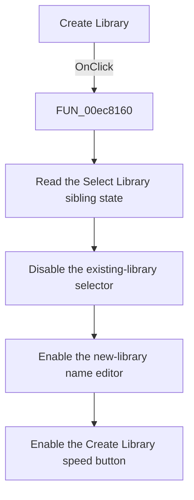

# Create Library

> Analysis status: Source, call-path, state, and error evidence reviewed.

## Control

| Property | Recovered value |
| --- | --- |
| Form | PcbForm4 |
| Component path | PcbForm4.Panel2.rbtnCreateLibrary |
| Control class | TRadioButton |
| Caption | Create Library |
| Hint | Not present in the recovered resource. |
| Text | Not present in the recovered resource. |
| Handler name | rbtnCreateLibraryClick |
| Handler address | 00ec8160 |
| Graph node | `resource:dfm:PcbForm4/PcbForm4.Panel2.rbtnCreateLibrary` |
| Handler node | `function:00ec8160` |
| Graph layer | UI |

## What happens when clicked

The click switches the library controls to Create Library mode. It does not create a file by itself.

The radio group has already cleared the sibling Select Library radio when this handler runs. The handler reads that sibling state, disables the existing-library selector, enables the new-library name editor, and enables the Create Library speed button. The paired recovered handler and [`sbtnCreateLibrary` article](sbtncreatelibrary-640f694660.md) confirm the control identities and later creation boundary.

## Click flow

## Handler evidence

- Source: [DecompiledSources/Tina16/functions/0000000000EC8160__FUN_00ec8160.c](../../../DecompiledSources/Tina16/functions/0000000000EC8160__FUN_00ec8160.c)
- Recovered role: Switches the form to new-library creation mode.
- Current graph summary: Handles 1 Delphi UI event: PcbForm4.Panel2.rbtnCreateLibrary.OnClick.
- Current graph behavior: Uses the cleared Select Library sibling state to disable the existing-library selector and enable both the new-library name editor and its Create Library speed button. It does not create or persist a library.
- Current graph evidence: FUN_00ec8160 reads one radio-button checked state and propagates that state and its inverse through three control enable setters. The paired Select Library handler performs the inverse configuration. FUN_00ec84d0 later reads the enabled name editor and performs creation.
- Complexity: simple
- Distinct outgoing calls: 0

## Direct calls

- No direct call edge is present in the recovered graph.

## Resource evidence

- Kind: Not present in the recovered resource.
- Modal result: Not present in the recovered resource.
- Checked state: Not present in the recovered resource.
- List items: Not present in the recovered resource.
- Image reference: Not present in the recovered resource.
- Extracted glyph: None.

## Nearby label candidates

Nearby labels are layout candidates only. They are not proof of behavior.

- Rank 1: Footprint list: at distance 112.
- Rank 2: Component list: at distance 198.

## No-op and error behavior

- Clicking an already selected Create Library radio reapplies the same enable state.
- The handler has no backend call, file creation, validation, or error message.

## Analysis limits

- The decompiler exposes controls by form offsets. Their identities are established from the paired radio handlers, the DFM bindings, and the later text-reader path.
