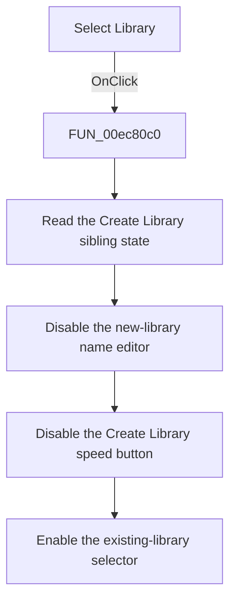

# Select Library

> Analysis status: Source, call-path, state, and error evidence reviewed.

## Control

| Property | Recovered value |
| --- | --- |
| Form | PcbForm4 |
| Component path | PcbForm4.Panel2.rbtnSelectLibrary |
| Control class | TRadioButton |
| Caption | Select Library |
| Hint | Not present in the recovered resource. |
| Text | Not present in the recovered resource. |
| Handler name | rbtnSelectLibraryClick |
| Handler address | 00ec80c0 |
| Graph node | `resource:dfm:PcbForm4/PcbForm4.Panel2.rbtnSelectLibrary` |
| Handler node | `function:00ec80c0` |
| Graph layer | UI |

## What happens when clicked

The click switches the controls to Select Library mode. It does not load a different library by itself.

The radio group has already cleared the sibling Create Library radio when this handler runs. The handler reads that sibling state, disables the new-library name editor and Create Library speed button, and enables the existing-library selector. The resource marks Select Library as checked initially, and FormShow reapplies this mode.

## Click flow

## Handler evidence

- Source: [DecompiledSources/Tina16/functions/0000000000EC80C0__FUN_00ec80c0.c](../../../DecompiledSources/Tina16/functions/0000000000EC80C0__FUN_00ec80c0.c)
- Recovered role: Switches the form to existing-library selection mode.
- Current graph summary: Handles 1 Delphi UI event: PcbForm4.Panel2.rbtnSelectLibrary.OnClick.
- Current graph behavior: Uses the cleared Create Library sibling state to disable the new-library name editor and Create Library speed button and enable the existing-library selector. It does not change the selected library itself.
- Current graph evidence: FUN_00ec80c0 reads one radio-button checked state and propagates it and its inverse through three control enable setters. The paired Create Library handler performs the inverse configuration. The DFM marks Select Library checked.
- Complexity: simple
- Distinct outgoing calls: 0

## Direct calls

- No direct call edge is present in the recovered graph.

## Resource evidence

- Kind: Not present in the recovered resource.
- Modal result: Not present in the recovered resource.
- Checked state: true
- List items: Not present in the recovered resource.
- Image reference: Not present in the recovered resource.
- Extracted glyph: None.

## Nearby label candidates

Nearby labels are layout candidates only. They are not proof of behavior.

- Rank 1: Component list: at distance 71.
- Rank 2: Footprint list: at distance 251.

## No-op and error behavior

- Clicking an already selected Select Library radio reapplies the same enable state.
- The handler has no backend selection, file access, validation, or error message.

## Analysis limits

- The graph has no direct call edge because all operations are recovered virtual control-property calls.
- Control identities are established from the paired handlers, DFM bindings, FormShow, and the library-creation text path.
