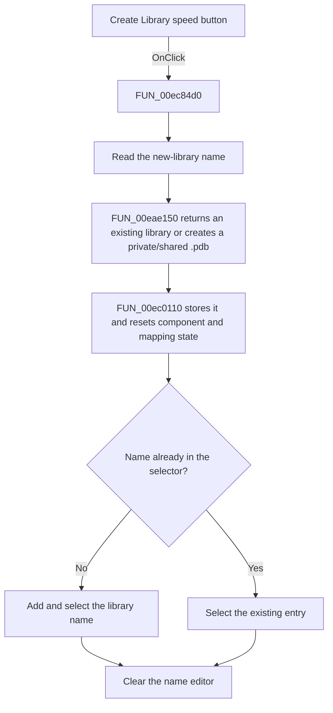

# Create Library

> Analysis status: Source, call-path, state, and error evidence reviewed.

## Control

| Property | Recovered value |
| --- | --- |
| Form | PcbForm4 |
| Component path | PcbForm4.Panel2.sbtnCreateLibrary |
| Control class | TSpeedButton |
| Caption | Not present in the recovered resource. |
| Hint | Create Library |
| Text | Not present in the recovered resource. |
| Handler name | sbtnCreateLibraryClick |
| Handler address | 00ec84d0 |
| Graph node | `resource:dfm:PcbForm4/PcbForm4.Panel2.sbtnCreateLibrary` |
| Handler node | `function:00ec84d0` |
| Graph layer | UI |

## What happens when clicked

The click creates or selects a PCB library with the name in the new-library editor, then switches the form back to Select Library mode.

The handler reads the editor text and calls [`FUN_00ec0110`](../../../DecompiledSources/Tina16/functions/0000000000EC0110__FUN_00ec0110.c). That helper calls [`FUN_00eae150`](../../../DecompiledSources/Tina16/functions/0000000000EAE150__FUN_00eae150.c), which returns an already loaded library with the same normalized name or creates a new `.pdb` library in the private or shared root selected by the form. The helper stores the active library, clears component and mapping state, selects the Select Library radio, and rebuilds the component view.

The click handler then adds the new name to the existing-library selector only when it is absent, selects and marks that entry, and clears the name editor. The two-folder glyph supports a library creation or selection action; the source proves the exact path.

## Click flow

## Handler evidence

- Source: [DecompiledSources/Tina16/functions/0000000000EC84D0__FUN_00ec84d0.c](../../../DecompiledSources/Tina16/functions/0000000000EC84D0__FUN_00ec84d0.c)
- Recovered role: Creates or selects a named private or shared PCB library.
- Current graph summary: Handles 1 Delphi UI event: PcbForm4.Panel2.sbtnCreateLibrary.OnClick.
- Current graph behavior: Reads the new-library text, opens an existing normalized-name match or creates a private/shared .pdb library, makes it active, resets component and mapping state, switches to selection mode, ensures the name is selected in the library selector, marks the entry, and clears the editor.
- Current graph evidence: FUN_00ec84d0 reads control text, calls FUN_00ec0110, searches and conditionally adds the text in a selector list, selects the row, sets item-associated state, and clears the editor. FUN_00ec0110 calls FUN_00eae150 with the private/shared selection, stores the returned object and name, clears state, selects the Select Library radio, and refreshes components. The inspected glyph shows two library-like folders.
- Complexity: complex
- Distinct outgoing calls: 4

## Direct calls

- `function:00414560` — Delphi UnicodeString array finalization helper
- `function:0064dd90` — VCL control Unicode text reader
- `function:0064de00` — VCL control text setter with change suppression
- `function:00ec0110` — FUN_00ec0110

## Resource evidence

- Kind: Not present in the recovered resource.
- Modal result: Not present in the recovered resource.
- Checked state: Not present in the recovered resource.
- List items: Not present in the recovered resource.
- Image reference: Not present in the recovered resource.
- Extracted glyph: [`0300_PcbForm4_PcbForm4_Panel2_sbtnCreateLibrary_Glyph_Data.png`](../../../glyph/0300_PcbForm4_PcbForm4_Panel2_sbtnCreateLibrary_Glyph_Data.png)

## Nearby label candidates

Nearby labels are layout candidates only. They are not proof of behavior.

- Rank 1: Footprint list: at distance 173.
- Rank 2: Component list: at distance 353.

## No-op and error behavior

- If a normalized-name library is already loaded, FUN_00eae150 returns that object instead of creating another collection entry.
- The handler adds no duplicate selector row.
- No explicit empty-name or invalid-path branch is visible in these functions. Any rejection can occur inside the recovered library constructor or file layer.
- The handler has no local file error recovery.

## Analysis limits

- The exact private and shared root paths come from global strings and are not named in the handler.
- The item-associated state set after selection is used by the later persistence path, but its Delphi property name is not recovered.
