# btnOK

> Analysis status: Pending individual source review.

## Control

| Property | Recovered value |
| --- | --- |
| Form | PCBWizard |
| Component path | PCBWizard.btnOK |
| Control class | TBitBtn |
| Caption | Not present in the recovered resource. |
| Hint | Not present in the recovered resource. |
| Text | Not present in the recovered resource. |
| Handler name | btnOKClick |
| Handler address | 01bb2d60 |
| Graph node | `resource:dfm:PCBWizard/PCBWizard.btnOK` |
| Handler node | `function:01bb2d60` |
| Graph layer | UI |

## What happens when clicked

Pending individual analysis. An agent must read the recovered handler source and its relevant callees before it replaces this text.

## Click flow

```mermaid
flowchart LR
    control["btnOK"] -->|OnClick| handler["FUN_01bb2d60"]
    handler --> call1["Nil-safe Delphi object destruction helper"]
    handler --> call2["Delphi UnicodeString clear and finalization helper"]
    handler --> call3["FUN_004144d0"]
    handler --> call4["FUN_00414520"]
    handler --> call5["Delphi UnicodeString array finalization helper"]
    handler --> call6["Delphi UnicodeString assignment helper"]
```

## Handler evidence

- Source: [DecompiledSources/Tina16/functions/0000000001BB2D60__FUN_01bb2d60.c](../../../DecompiledSources/Tina16/functions/0000000001BB2D60__FUN_01bb2d60.c)
- Recovered role: Not present in the recovered resource.
- Current graph summary: Handles 1 Delphi UI event: PCBWizard.btnOK.OnClick.
- Current graph behavior: Not present in the recovered resource.
- Current graph evidence: Not present in the recovered resource.
- Complexity: complex
- Distinct outgoing calls: 19

## Direct calls

- `function:00410f20` — Nil-safe Delphi object destruction helper
- `function:00414480` — Delphi UnicodeString clear and finalization helper
- `function:004144d0` — FUN_004144d0
- `function:00414520` — FUN_00414520
- `function:00414560` — Delphi UnicodeString array finalization helper
- `function:00414ad0` — Delphi UnicodeString assignment helper
- `function:00416880` — FUN_00416880
- `function:004168e0` — FUN_004168e0
- `function:00416ad0` — FUN_00416ad0
- `function:00416cd0` — FUN_00416cd0
- `function:00440a20` — FUN_00440a20
- `function:00441640` — FUN_00441640
- `function:00448450` — FUN_00448450
- `function:005da0f0` — FUN_005da0f0
- `function:00b0cea0` — FUN_00b0cea0
- `function:00b90090` — FUN_00b90090
- `function:01bb3cc0` — FUN_01bb3cc0
- `function:01bb3d90` — FUN_01bb3d90
- `function:01bb3de0` — FUN_01bb3de0

## Resource evidence

- Kind: bkOK
- Modal result: Not present in the recovered resource.
- Checked state: Not present in the recovered resource.
- List items: Not present in the recovered resource.
- Image reference: Not present in the recovered resource.
- Extracted glyph: None.

## Nearby label candidates

Nearby labels are layout candidates only. They are not proof of behavior.

- No same-parent label candidate is available.

## Analysis limits

- Do not infer behavior from the control class, caption, hint, glyph, or nearby label alone.
- Do not replace the pending status until the handler source and relevant call path provide enough evidence.
