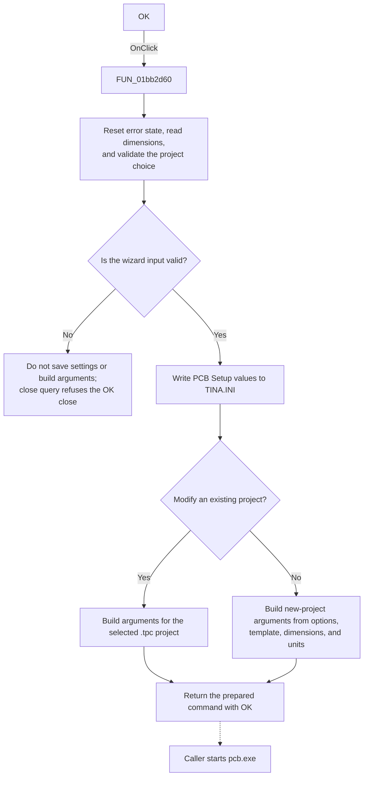

# btnOK

> Analysis status: Reviewed from the recovered handler, validation helpers, form close-query path, configuration writes, and the caller that consumes the result.

## Control

| Property | Recovered value |
| --- | --- |
| Form | PCBWizard |
| Component path | PCBWizard.btnOK |
| Control class | TBitBtn |
| Caption | Not present in the recovered resource. |
| Hint | Not present in the recovered resource. |
| Text | Not present in the recovered resource. |
| Handler name | btnOKClick |
| Handler address | 01bb2d60 |
| Graph node | `resource:dfm:PCBWizard/PCBWizard.btnOK` |
| Handler node | `function:01bb2d60` |
| Graph layer | UI |

## What happens when clicked

The handler first resets the form's numeric-error flag and reads the board width and height edits. A numeric edit error uses the shared validation-error path and sets this flag. The handler then checks two conditions:

- The numeric-error flag must be clear.
- If **Modify existing project** is selected, the project combo box must contain at least one item.

If either condition fails, the handler does not write the PCB settings or build launch arguments. The form's recovered close-query handler calls the same check for the OK modal result and refuses the close when the check fails.

For valid input, the handler writes these values to the `PCB Setup` section of `TINA.INI`:

- `Auto placement`
- `Auto route`
- `Use template`
- `Template`
- `Board width`
- `Board height`

It converts the displayed width and height to the internal mil-based values before it writes them. Inch values are multiplied by `1000`. Millimeter values are multiplied by approximately `39.37007874`. The handler temporarily uses `.` as the decimal separator for the stored dimensions and then restores the prior separator.

The handler also builds a command string in a form field for the caller:

- For an existing project, it uses the selected `.tpc` project from the active document directory and appends the current unit option.
- For a new project, it includes the active input, the enabled and selected auto-placement and auto-route states, board dimensions, and the current unit option. It includes the stored template path only when **Use board template** is selected and that path passes the recovered file check.

A selected but missing template is omitted from the command without a message. After the `bkOK` button completes the modal dialog, the recovered caller reads the command field and starts `pcb.exe`. This click handler prepares that command; it does not start the process itself.

## Click flow

## Handler evidence

- Source: [DecompiledSources/Tina16/functions/0000000001BB2D60__FUN_01bb2d60.c](../../../DecompiledSources/Tina16/functions/0000000001BB2D60__FUN_01bb2d60.c)
- Recovered role: Validate and accept PCB wizard settings and prepare PCB launch arguments.
- Current graph summary: Handles 1 Delphi UI event: PCBWizard.btnOK.OnClick.
- Current graph behavior: Validates the numeric board dimensions and existing-project choice, persists PCB setup options, and prepares mode-specific launch arguments for the modal caller.
- Current graph evidence: `FUN_01bb2d60` calls `FUN_01bb3cc0` and `FUN_01bb3d90`, writes six recovered `PCB Setup` keys through the INI object, converts both float edits through `FUN_01bb3de0`, branches on the recovered project and template controls, checks the stored template path with `FUN_00440a20`, and stores the constructed Unicode command at form offset `0x778`. The recovered caller `FUN_01c99370` reads that field after an OK modal result and passes it to the `pcb.exe` launch path.
- Complexity: complex
- Distinct outgoing calls: 19

## Direct calls

- `function:00410f20` — Nil-safe Delphi object destruction helper
- `function:00414480` — Delphi UnicodeString clear and finalization helper
- `function:004144d0` — FUN_004144d0
- `function:00414520` — FUN_00414520
- `function:00414560` — Delphi UnicodeString array finalization helper
- `function:00414ad0` — Delphi UnicodeString assignment helper
- `function:00416880` — FUN_00416880
- `function:004168e0` — FUN_004168e0
- `function:00416ad0` — FUN_00416ad0
- `function:00416cd0` — FUN_00416cd0
- `function:00440a20` — FUN_00440a20
- `function:00441640` — FUN_00441640
- `function:00448450` — FUN_00448450
- `function:005da0f0` — FUN_005da0f0
- `function:00b0cea0` — FUN_00b0cea0
- `function:00b90090` — FUN_00b90090
- `function:01bb3cc0` — FUN_01bb3cc0
- `function:01bb3d90` — FUN_01bb3d90
- `function:01bb3de0` — FUN_01bb3de0

## Resource evidence

- Kind: bkOK
- Modal result: Not present in the recovered resource.
- Checked state: Not present in the recovered resource.
- List items: Not present in the recovered resource.
- Image reference: Not present in the recovered resource.
- Extracted glyph: None.

## Nearby label candidates

Nearby labels are layout candidates only. They are not proof of behavior.

- No same-parent label candidate is available.

## Analysis limits

- The recovered source does not name every command-line option held in address-based string constants. The article describes only the values and branches that the call-site data flow proves.
- The handler has no local exception recovery for INI, path, or string operations.
- The empty existing-project list has no explicit message in this handler. A numeric edit error uses a shared error-reporting function, but its exact presentation is not recovered here.

## Downstream evidence

- Modal caller: [DecompiledSources/Tina16/functions/0000000001C99370__FUN_01c99370.c](../../../DecompiledSources/Tina16/functions/0000000001C99370__FUN_01c99370.c)
- Close-query validation: [DecompiledSources/Tina16/functions/0000000001BB2810__FUN_01bb2810.c](../../../DecompiledSources/Tina16/functions/0000000001BB2810__FUN_01bb2810.c)
