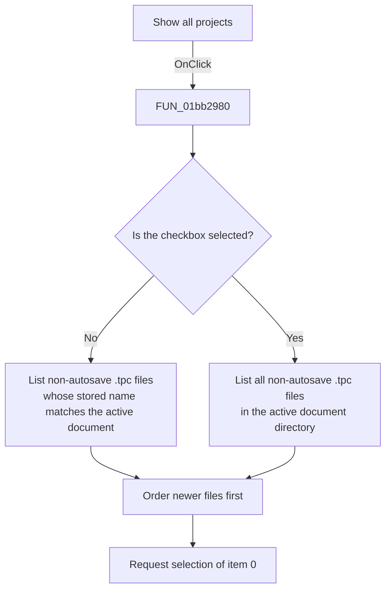

# Show all projects

> Analysis status: Reviewed from the recovered handler, project-list helper, form resources, and combo-box consumer.

## Control

| Property | Recovered value |
| --- | --- |
| Form | PCBWizard |
| Component path | PCBWizard.pnlProject.cbShowAll |
| Control class | TCheckBox |
| Caption | Show all projects |
| Hint | Not present in the recovered resource. |
| Text | Not present in the recovered resource. |
| Handler name | cbShowAllClick |
| Handler address | 01bb2980 |
| Graph node | `resource:dfm:PCBWizard/PCBWizard.pnlProject.cbShowAll` |
| Handler node | `function:01bb2980` |
| Graph layer | UI |

## What happens when clicked

The handler reads the checkbox state and rebuilds the project combo box through `FUN_01bb1cf0`. The helper clears the list and enumerates `*.tpc` files in the active document directory. It skips file names that contain `autosave`.

For each remaining project file, the helper reads its first length-prefixed text value and compares that value, without letter case, with the active document base name. When **Show all projects** is clear, it includes only matching files. When the checkbox is selected, it includes all non-autosave `.tpc` files without this match requirement.

The helper orders included entries from newer to older by the recovered file time. After the rebuild, the click handler requests combo-box item index `0`, which selects the first entry when the list has one. If enumeration finds no eligible project, the list stays empty. The later OK validation prevents the existing-project mode from closing successfully with an empty list.

## Click flow

## Handler evidence

- Source: [DecompiledSources/Tina16/functions/0000000001BB2980__FUN_01bb2980.c](../../../DecompiledSources/Tina16/functions/0000000001BB2980__FUN_01bb2980.c)
- Recovered role: Rebuild the existing PCB project list with or without the active-document filter.
- Current graph summary: Handles 1 Delphi UI event: PCBWizard.pnlProject.cbShowAll.OnClick.
- Current graph behavior: Passes the checkbox state to the recovered `.tpc` enumerator and then resets the project combo selection to its first entry.
- Current graph evidence: `FUN_01bb2980` reads the check state from form field `0x6d8`, passes it to `FUN_01bb1cf0` with the Items object of the combo at `0x6e0`, and then calls that combo's item-index setter with `0`. `FUN_01bb1cf0` clears the list, enumerates `*.tpc`, excludes `autosave`, applies the active-base-name comparison only when its Boolean argument is false, and inserts entries by recovered file time.
- Complexity: simple
- Distinct outgoing calls: 1

## Direct calls

- `function:01bb1cf0` — FUN_01bb1cf0

## Resource evidence

- Kind: Not present in the recovered resource.
- Modal result: Not present in the recovered resource.
- Checked state: Not present in the recovered resource.
- List items: Not present in the recovered resource.
- Image reference: Not present in the recovered resource.
- Extracted glyph: None.

## Nearby label candidates

Nearby labels are layout candidates only. They are not proof of behavior.

- No same-parent label candidate is available.

## Analysis limits

- The recovered handler does not show a message when enumeration fails or produces an empty list.
- The exact VCL behavior of requesting item index `0` for an empty combo box is not established by this handler.
