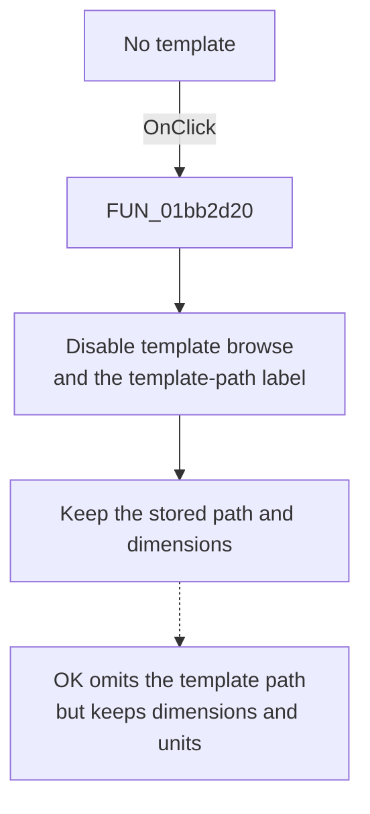

# &No template

> Analysis status: Reviewed from the recovered handler, template-mode peer, OK consumer, and form resources.

## Control

| Property | Recovered value |
| --- | --- |
| Form | PCBWizard |
| Component path | PCBWizard.pnlTemplate.rbBoardSize |
| Control class | TRadioButton |
| Caption | &No template |
| Hint | Not present in the recovered resource. |
| Text | Not present in the recovered resource. |
| Handler name | rbBoardSizeClick |
| Handler address | 01bb2d20 |
| Graph node | `resource:dfm:PCBWizard/PCBWizard.pnlTemplate.rbBoardSize` |
| Handler node | `function:01bb2d20` |
| Graph layer | UI |

## What happens when clicked

The handler disables the template browse button and the template-path label. It does not clear the stored template path, change the label text, or change the board width and height values.

The later OK handler checks the **Use board template** radio state. With **No template** selected, it does not add the stored template path to the new-project launch arguments. It still adds the current board dimensions and units.

Repeated clicks only apply the same disabled states again.

## Click flow

## Handler evidence

- Source: [DecompiledSources/Tina16/functions/0000000001BB2D20__FUN_01bb2d20.c](../../../DecompiledSources/Tina16/functions/0000000001BB2D20__FUN_01bb2d20.c)
- Recovered role: Disable template-file input for manual PCB board dimensions.
- Current graph summary: Handles 1 Delphi UI event: PCBWizard.pnlTemplate.rbBoardSize.OnClick.
- Current graph behavior: Disables the template browse control and template-path label without changing their stored data or the board dimensions.
- Current graph evidence: `FUN_01bb2d20` calls the enabled-state setter with false for form fields `0x718` and `0x710`. The form resource identifies the corresponding controls as `sbBrowseTemplate` and `lblTemplate`. `FUN_01bb2d60` reads the separate radio field at `0x708` before it considers the stored template path and always includes the current dimensions in new-project arguments.
- Complexity: simple
- Distinct outgoing calls: 0

## Direct calls

- No direct call edge is present in the recovered graph.

## Resource evidence

- Kind: Not present in the recovered resource.
- Modal result: Not present in the recovered resource.
- Checked state: Not present in the recovered resource.
- List items: Not present in the recovered resource.
- Image reference: Not present in the recovered resource.
- Extracted glyph: None.

## Nearby label candidates

Nearby labels are layout candidates only. They are not proof of behavior.

- Rank 1: Board &width at distance 43.
- Rank 2: Board &height at distance 69.
- Rank 3: (inch) at distance 250.

## Analysis limits

- The recovered calls are virtual enabled-state operations, so the graph has no direct call edge for them.
- The handler does not validate or reset the board dimensions.
