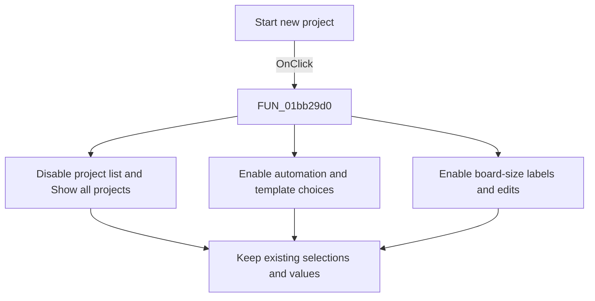

# Start &new project

> Analysis status: Reviewed from the recovered handler, form initialization, OK consumer, and form resources.

## Control

| Property | Recovered value |
| --- | --- |
| Form | PCBWizard |
| Component path | PCBWizard.pnlProject.rbNewProject |
| Control class | TRadioButton |
| Caption | Start &new project |
| Hint | Not present in the recovered resource. |
| Text | Not present in the recovered resource. |
| Handler name | rbNewProjectClick |
| Handler address | 01bb29d0 |
| Graph node | `resource:dfm:PCBWizard/PCBWizard.pnlProject.rbNewProject` |
| Handler node | `function:01bb29d0` |
| Graph layer | UI |

## What happens when clicked

The handler changes the wizard from existing-project input to new-project input. It disables the project combo box and **Show all projects**. It enables these controls:

- **Autoplacement** and **Autorouting**
- **Use board template** and **No template**
- The template browse button and template-path label
- The board-width and board-height labels and numeric edits

The width and height edit states are copied from their corresponding label states after the labels have been enabled, so both edits become enabled. The handler does not clear or replace any current option, template path, or dimension value. It also does not inspect the current template radio selection before it enables the browse button and path label.

The later OK handler uses this mode to build new-project launch arguments. It includes enabled and selected automation options, an existing template file when template mode is selected, board dimensions, and units.

## Click flow

## Handler evidence

- Source: [DecompiledSources/Tina16/functions/0000000001BB29D0__FUN_01bb29d0.c](../../../DecompiledSources/Tina16/functions/0000000001BB29D0__FUN_01bb29d0.c)
- Recovered role: Enable the PCB wizard controls for new-project creation.
- Current graph summary: Handles 1 Delphi UI event: PCBWizard.pnlProject.rbNewProject.OnClick.
- Current graph behavior: Disables existing-project selection and enables the automation, template, and board-size inputs used by the new-project OK path.
- Current graph evidence: `FUN_01bb29d0` applies disabled state to form fields `0x6e0` and `0x6d8`, and enabled state to fields `0x6f0`, `0x6f8`, `0x708`, `0x710`, `0x718`, `0x720`, `0x728`, and `0x730`. It then copies the enabled states of `0x728` and `0x730` to the numeric edits at `0x738` and `0x740`. Form creation and `FUN_01bb2d60` identify these fields and their downstream use.
- Complexity: simple
- Distinct outgoing calls: 0

## Direct calls

- No direct call edge is present in the recovered graph.

## Resource evidence

- Kind: Not present in the recovered resource.
- Modal result: Not present in the recovered resource.
- Checked state: true
- List items: Not present in the recovered resource.
- Image reference: Not present in the recovered resource.
- Extracted glyph: None.

## Nearby label candidates

Nearby labels are layout candidates only. They are not proof of behavior.

- No same-parent label candidate is available.

## Analysis limits

- The recovered calls are virtual enabled-state operations, so the graph has no direct call edge for them.
- The handler does not populate the project list, validate dimensions, persist settings, or build the launch command.
