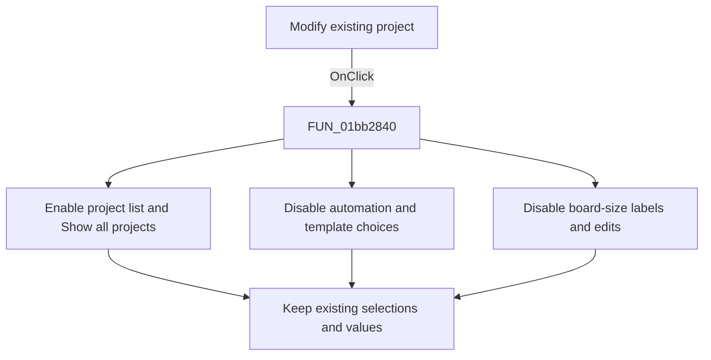

# Modify &existing project

> Analysis status: Reviewed from the recovered handler, form initialization, OK consumer, and form resources.

## Control

| Property | Recovered value |
| --- | --- |
| Form | PCBWizard |
| Component path | PCBWizard.pnlProject.rbOpenProject |
| Control class | TRadioButton |
| Caption | Modify &existing project |
| Hint | Not present in the recovered resource. |
| Text | Not present in the recovered resource. |
| Handler name | rbOpenProjectClick |
| Handler address | 01bb2840 |
| Graph node | `resource:dfm:PCBWizard/PCBWizard.pnlProject.rbOpenProject` |
| Handler node | `function:01bb2840` |
| Graph layer | UI |

## What happens when clicked

The handler changes the wizard from new-project input to existing-project input. It enables the project combo box and **Show all projects**. It disables these controls:

- **Autoplacement** and **Autorouting**
- **Use board template** and **No template**
- The template browse button and template-path label
- The board-width and board-height labels and numeric edits

The width and height edit states are copied from their corresponding label states after the labels have been disabled, so both edits become disabled. The handler does not rebuild the project list, change the selected project, or clear any new-project option or value.

The later OK handler uses the selected combo-box entry for the existing-project launch arguments. If the combo list is empty, the shared OK and close-query validation blocks acceptance.

## Click flow

## Handler evidence

- Source: [DecompiledSources/Tina16/functions/0000000001BB2840__FUN_01bb2840.c](../../../DecompiledSources/Tina16/functions/0000000001BB2840__FUN_01bb2840.c)
- Recovered role: Enable the PCB wizard controls for existing-project selection.
- Current graph summary: Handles 1 Delphi UI event: PCBWizard.pnlProject.rbOpenProject.OnClick.
- Current graph behavior: Enables the existing-project controls and disables the new-project automation, template, and board-size inputs.
- Current graph evidence: `FUN_01bb2840` applies enabled state to form fields `0x6e0` and `0x6d8`, and disabled state to fields `0x6f0`, `0x6f8`, `0x708`, `0x710`, `0x718`, `0x720`, `0x728`, and `0x730`. It then copies the disabled label states to numeric edits `0x738` and `0x740`. Form creation and `FUN_01bb2d60` identify these fields and show that the OK path reads the project combo in this mode.
- Complexity: simple
- Distinct outgoing calls: 0

## Direct calls

- No direct call edge is present in the recovered graph.

## Resource evidence

- Kind: Not present in the recovered resource.
- Modal result: Not present in the recovered resource.
- Checked state: Not present in the recovered resource.
- List items: Not present in the recovered resource.
- Image reference: Not present in the recovered resource.
- Extracted glyph: None.

## Nearby label candidates

Nearby labels are layout candidates only. They are not proof of behavior.

- No same-parent label candidate is available.

## Analysis limits

- The recovered calls are virtual enabled-state operations, so the graph has no direct call edge for them.
- The handler does not report an empty project list. That check occurs during OK and close-query validation.
