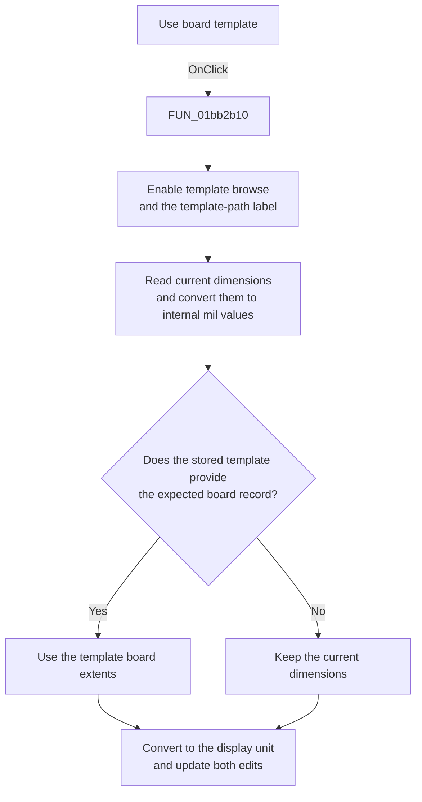

# Use board &template

> Analysis status: Reviewed from the recovered handler, template parser, dimension conversion helpers, and form resources.

## Control

| Property | Recovered value |
| --- | --- |
| Form | PCBWizard |
| Component path | PCBWizard.pnlTemplate.rbTemplate |
| Control class | TRadioButton |
| Caption | Use board &template |
| Hint | Not present in the recovered resource. |
| Text | Not present in the recovered resource. |
| Handler name | rbTemplateClick |
| Handler address | 01bb2b10 |
| Graph node | `resource:dfm:PCBWizard/PCBWizard.pnlTemplate.rbTemplate` |
| Handler node | `function:01bb2b10` |
| Graph layer | UI |

## What happens when clicked

The handler enables the template browse button and the template-path label. It then reads the current board width and height and converts them from the displayed unit to internal mil-based values.

Next, it tries to read the stored template path. If the file passes the recovered path check and contains the expected board record, the parser replaces the two internal values with the template's board extents. The handler converts the resulting values back to the displayed unit and writes them to the width and height edits.

If the path check fails or no expected board record is found, the parser leaves the supplied fallback values unchanged. The read-and-write conversion therefore preserves the current displayed dimensions, apart from normal floating-point formatting behavior. This click does not open the file dialog. **Browse...** performs file selection.

## Click flow

## Handler evidence

- Source: [DecompiledSources/Tina16/functions/0000000001BB2B10__FUN_01bb2b10.c](../../../DecompiledSources/Tina16/functions/0000000001BB2B10__FUN_01bb2b10.c)
- Recovered role: Enable PCB template input and refresh dimensions from the stored template.
- Current graph summary: Handles 1 Delphi UI event: PCBWizard.pnlTemplate.rbTemplate.OnClick.
- Current graph behavior: Enables template controls, uses the current dimensions as fallback values, reads board extents from the stored template when possible, and updates the displayed width and height.
- Current graph evidence: `FUN_01bb2b10` enables form fields `0x718` and `0x710`, calls `FUN_01bb3de0` to read and normalize edits `0x738` and `0x740`, passes form field `0x780` to `FUN_01bb3f00`, and calls `FUN_01bb3e80` to convert and write both edit values. The parser changes its output parameters only after a file check and a recovered record-type test.
- Complexity: complex
- Distinct outgoing calls: 3

## Direct calls

- `function:01bb3de0` — FUN_01bb3de0
- `function:01bb3e80` — FUN_01bb3e80
- `function:01bb3f00` — FUN_01bb3f00

## Resource evidence

- Kind: Not present in the recovered resource.
- Modal result: Not present in the recovered resource.
- Checked state: true
- List items: Not present in the recovered resource.
- Image reference: Not present in the recovered resource.
- Extracted glyph: None.

## Nearby label candidates

Nearby labels are layout candidates only. They are not proof of behavior.

- Rank 1: Board &width at distance 115.
- Rank 2: Board &height at distance 141.
- Rank 3: (inch) at distance 322.

## Analysis limits

- The recovered parser does not expose a Delphi type name for the template file format or board record.
- The handler shows no message for a missing file or missing expected record and has no local exception recovery for a malformed file.
