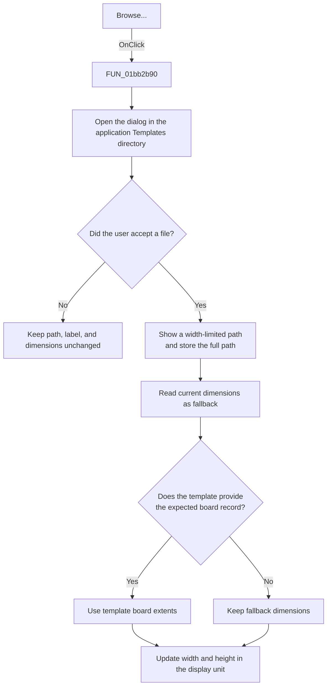

# Browse...

> Analysis status: Reviewed from the recovered handler, open-dialog helpers, path display helper, template parser, and form resources.

## Control

| Property | Recovered value |
| --- | --- |
| Form | PCBWizard |
| Component path | PCBWizard.pnlTemplate.sbBrowseTemplate |
| Control class | TSpeedButton |
| Caption | Browse... |
| Hint | Not present in the recovered resource. |
| Text | Not present in the recovered resource. |
| Handler name | sbBrowseTemplateClick |
| Handler address | 01bb2b90 |
| Graph node | `resource:dfm:PCBWizard/PCBWizard.pnlTemplate.sbBrowseTemplate` |
| Handler node | `function:01bb2b90` |
| Graph layer | UI |

## What happens when clicked

The handler sets the open dialog's initial directory to the application's `Templates` directory and opens the dialog. The recovered source does not set a filter in this handler.

If the user cancels, the stored template path, displayed path, and board dimensions stay unchanged. If the user accepts a file, the handler:

1. Reads the selected full file name.
2. Shortens only the displayed copy as needed to fit the template label and writes that copy to `lblTemplate`.
3. Stores the full selected path in the form field used by the OK handler.
4. Reads the current board dimensions as fallback values.
5. Tries to extract board extents from the selected template.
6. Converts the result to the displayed unit and updates the width and height edits.

If the selected path fails the later path check or does not contain the expected board record, the label and stored path still change, but the current dimensions remain as the fallback values. The handler does not show a specific message for that case.

## Click flow

## Handler evidence

- Source: [DecompiledSources/Tina16/functions/0000000001BB2B90__FUN_01bb2b90.c](../../../DecompiledSources/Tina16/functions/0000000001BB2B90__FUN_01bb2b90.c)
- Recovered role: Select a PCB template file and refresh the board dimensions.
- Current graph summary: Handles 1 Delphi UI event: PCBWizard.pnlTemplate.sbBrowseTemplate.OnClick.
- Current graph behavior: Opens the template dialog, stores and displays an accepted path, and updates the board dimensions from the expected template record when available.
- Current graph evidence: `FUN_01bb2b90` builds the `Templates` directory, calls `FUN_00724420`, executes the dialog, and branches on its Boolean result. The accepted branch gets the full path through `FUN_00724270`, formats a label copy through `FUN_00b965d0`, stores the unmodified path at form offset `0x780`, and uses `FUN_01bb3de0`, `FUN_01bb3f00`, and `FUN_01bb3e80` for fallback, parsing, and display conversion.
- Complexity: complex
- Distinct outgoing calls: 11

## Direct calls

- `function:00414480` — Delphi UnicodeString clear and finalization helper
- `function:00414560` — Delphi UnicodeString array finalization helper
- `function:00414ad0` — Delphi UnicodeString assignment helper
- `function:00416ba0` — FUN_00416ba0
- `function:0064de00` — VCL control text setter with change suppression
- `function:00724270` — FUN_00724270
- `function:00724420` — FUN_00724420
- `function:00b965d0` — FUN_00b965d0
- `function:01bb3de0` — FUN_01bb3de0
- `function:01bb3e80` — FUN_01bb3e80
- `function:01bb3f00` — FUN_01bb3f00

## Resource evidence

- Kind: Not present in the recovered resource.
- Modal result: Not present in the recovered resource.
- Checked state: Not present in the recovered resource.
- List items: Not present in the recovered resource.
- Image reference: Not present in the recovered resource.
- Extracted glyph: None.

## Nearby label candidates

Nearby labels are layout candidates only. They are not proof of behavior.

- Rank 1: Board &width at distance 62.
- Rank 2: Board &height at distance 88.
- Rank 3: (inch) at distance 255.

## Analysis limits

- The dialog's filter and title are not present in the recovered handler or selected resource properties.
- The recovered parser does not expose a Delphi type name for the template format and has no local exception recovery for malformed input.
