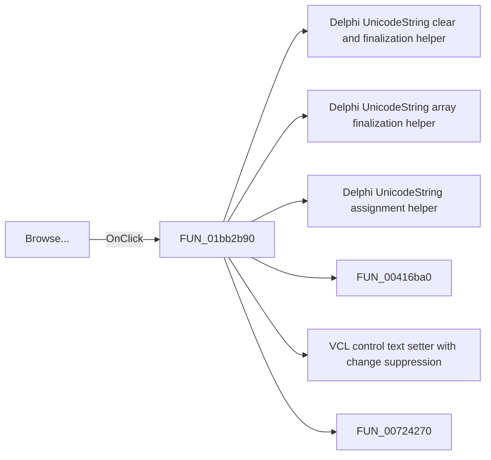

# Browse...

> Analysis status: Pending individual source review.

## Control

| Property | Recovered value |
| --- | --- |
| Form | PCBWizard |
| Component path | PCBWizard.pnlTemplate.sbBrowseTemplate |
| Control class | TSpeedButton |
| Caption | Browse... |
| Hint | Not present in the recovered resource. |
| Text | Not present in the recovered resource. |
| Handler name | sbBrowseTemplateClick |
| Handler address | 01bb2b90 |
| Graph node | `resource:dfm:PCBWizard/PCBWizard.pnlTemplate.sbBrowseTemplate` |
| Handler node | `function:01bb2b90` |
| Graph layer | UI |

## What happens when clicked

Pending individual analysis. An agent must read the recovered handler source and its relevant callees before it replaces this text.

## Click flow

## Handler evidence

- Source: [DecompiledSources/Tina16/functions/0000000001BB2B90__FUN_01bb2b90.c](../../../DecompiledSources/Tina16/functions/0000000001BB2B90__FUN_01bb2b90.c)
- Recovered role: Not present in the recovered resource.
- Current graph summary: Handles 1 Delphi UI event: PCBWizard.pnlTemplate.sbBrowseTemplate.OnClick.
- Current graph behavior: Not present in the recovered resource.
- Current graph evidence: Not present in the recovered resource.
- Complexity: complex
- Distinct outgoing calls: 11

## Direct calls

- `function:00414480` — Delphi UnicodeString clear and finalization helper
- `function:00414560` — Delphi UnicodeString array finalization helper
- `function:00414ad0` — Delphi UnicodeString assignment helper
- `function:00416ba0` — FUN_00416ba0
- `function:0064de00` — VCL control text setter with change suppression
- `function:00724270` — FUN_00724270
- `function:00724420` — FUN_00724420
- `function:00b965d0` — FUN_00b965d0
- `function:01bb3de0` — FUN_01bb3de0
- `function:01bb3e80` — FUN_01bb3e80
- `function:01bb3f00` — FUN_01bb3f00

## Resource evidence

- Kind: Not present in the recovered resource.
- Modal result: Not present in the recovered resource.
- Checked state: Not present in the recovered resource.
- List items: Not present in the recovered resource.
- Image reference: Not present in the recovered resource.
- Extracted glyph: None.

## Nearby label candidates

Nearby labels are layout candidates only. They are not proof of behavior.

- Rank 1: Board &width at distance 62.
- Rank 2: Board &height at distance 88.
- Rank 3: (inch) at distance 255.

## Analysis limits

- Do not infer behavior from the control class, caption, hint, glyph, or nearby label alone.
- Do not replace the pending status until the handler source and relevant call path provide enough evidence.
