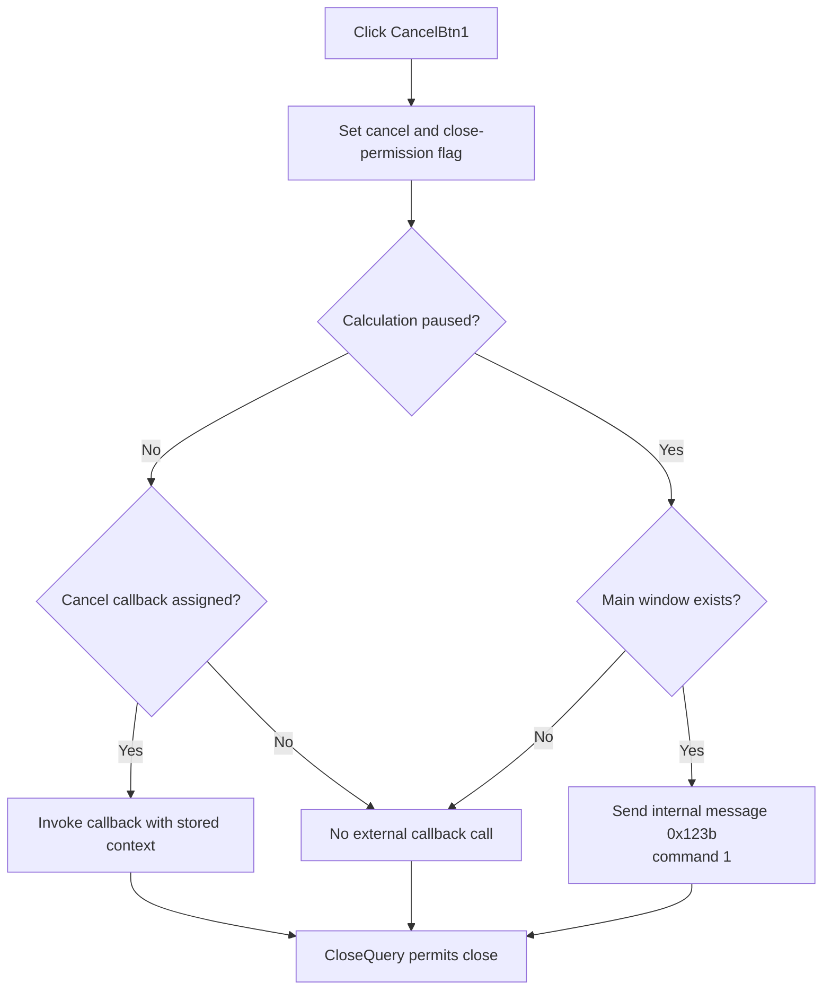

# Cancel from the cancel-only page

> Analysis status: Reviewed from the shared cancel handler, form close-query path, callback setter, paused-state message path, progress-completion path, and form resource.

## Control

| Property | Recovered value |
| --- | --- |
| Form | PercentageDlg |
| Form caption | Calculating |
| Component path | PercentageDlg.BtnNotebook.tsCancel.CancelBtn1 |
| Parent page | tsCancel |
| Control class | TBitBtn |
| Button kind | bkCancel |
| Handler name | CancelBtnClick |
| Handler address | 01af11d0 |
| Graph node | `resource:dfm:PercentageDlg/PercentageDlg.BtnNotebook.tsCancel.CancelBtn1` |
| Handler node | `function:01af11d0` |
| Graph layer | UI |

## What happens when clicked

`TPercentageDlg.CancelBtnClick` first sets form flag `+0x7b0` to `1`. `TPercentageDlg.FormCloseQuery` returns this flag as its close permission, so the cancel action can close the progress dialog.

The remaining cancellation signal depends on the form's running or paused state at `+0x7a0`:

- **Running:** if an external cancel callback is assigned at `+0x798`, the handler invokes it with the stored context at `+0x788`.
- **Paused:** if the global main window exists, the handler gets its window handle and sends internal message `0x123b` with command `1`.

The handler does not inspect `Sender`. `CancelBtn1` and `CancelBtn2` use the same code. This control is the cancel button on the `tsCancel` page, which contains no Preview or Pause button.

## Click flow

## Handler and state evidence

- [FUN_01af11d0](../../../DecompiledSources/Tina16/functions/0000000001AF11D0__FUN_01af11d0.c) sets flag `+0x7b0`, invokes the optional callback in running state, and sends command `1` to the main window in paused state.
- [FUN_01af18a0](../../../DecompiledSources/Tina16/functions/0000000001AF18A0__FUN_01af18a0.c) returns flag `+0x7b0` as the form's `CanClose` result.
- [FUN_01af2a70](../../../DecompiledSources/Tina16/functions/0000000001AF2A70__FUN_01af2a70.c) is the recovered wrapper setter that stores the optional cancel callback at `+0x798`.
- [FUN_0065b870](../../../DecompiledSources/Tina16/functions/000000000065B870__FUN_0065b870.c) ensures the main window handle exists and returns it for the paused-state message.
- [FUN_01af18b0](../../../DecompiledSources/Tina16/functions/0000000001AF18B0__FUN_01af18b0.c) uses flag `+0x7a0` as the same running or paused state for the Pause or Run action.
- [FUN_01af0e20](../../../DecompiledSources/Tina16/functions/0000000001AF0E20__FUN_01af0e20.c) also sets `+0x7b0` when progress reaches 100 percent. This confirms that the flag permits normal progress-dialog closure.

## Resource evidence

- The form caption is `Calculating` and includes a progress gauge and live calculation labels.
- `CancelBtn1` has `Kind = bkCancel` and is the only button on `BtnNotebook.tsCancel`.
- The control has no separate caption, hint, image reference, or extracted glyph.

## State, error, and no-op behavior

- The close-permission flag is set even when no callback is assigned or no main window exists.
- A missing callback in running state skips only the external notification.
- A missing main window in paused state skips only the internal message.
- The callback return value and message result are not checked.
- The handler has no error message, retry, or rollback path.

## Analysis limits

- The assigned cancel callback's implementation depends on the calculation that opened the shared progress dialog.
- Internal message `0x123b`, command `1`, is the paused-state cancel signal. The recovered click path does not expose a Delphi constant name for it.
