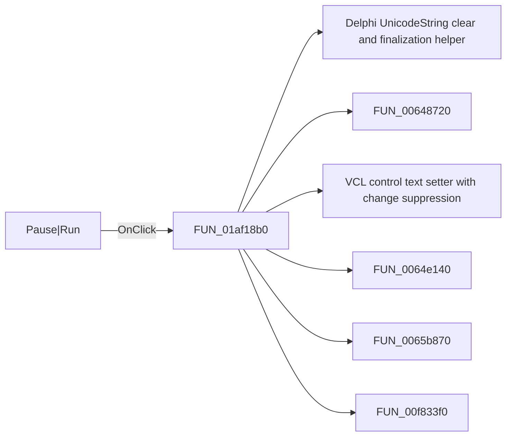

# Pause|Run

> Analysis status: Pending individual source review.

## Control

| Property | Recovered value |
| --- | --- |
| Form | PercentageDlg |
| Component path | PercentageDlg.BtnNotebook.tsCancelPreview.PauseBtn |
| Control class | TBitBtn |
| Caption | Pause\|Run |
| Hint | Not present in the recovered resource. |
| Text | Not present in the recovered resource. |
| Handler name | PauseBtnClick |
| Handler address | 01af18b0 |
| Graph node | `resource:dfm:PercentageDlg/PercentageDlg.BtnNotebook.tsCancelPreview.PauseBtn` |
| Handler node | `function:01af18b0` |
| Graph layer | UI |

## What happens when clicked

Pending individual analysis. An agent must read the recovered handler source and its relevant callees before it replaces this text.

## Click flow

## Handler evidence

- Source: [DecompiledSources/Tina16/functions/0000000001AF18B0__FUN_01af18b0.c](../../../DecompiledSources/Tina16/functions/0000000001AF18B0__FUN_01af18b0.c)
- Recovered role: Not present in the recovered resource.
- Current graph summary: Handles 1 Delphi UI event: PercentageDlg.BtnNotebook.tsCancelPreview.PauseBtn.OnClick.
- Current graph behavior: Not present in the recovered resource.
- Current graph evidence: Not present in the recovered resource.
- Complexity: complex
- Distinct outgoing calls: 7

## Direct calls

- `function:00414480` — Delphi UnicodeString clear and finalization helper
- `function:00648720` — FUN_00648720
- `function:0064de00` — VCL control text setter with change suppression
- `function:0064e140` — FUN_0064e140
- `function:0065b870` — FUN_0065b870
- `function:00f833f0` — FUN_00f833f0
- `function:00f834f0` — FUN_00f834f0

## Resource evidence

- Kind: Not present in the recovered resource.
- Modal result: Not present in the recovered resource.
- Checked state: Not present in the recovered resource.
- List items: Not present in the recovered resource.
- Image reference: Not present in the recovered resource.
- Extracted glyph: None.

## Nearby label candidates

Nearby labels are layout candidates only. They are not proof of behavior.

- No same-parent label candidate is available.

## Analysis limits

- Do not infer behavior from the control class, caption, hint, glyph, or nearby label alone.
- Do not replace the pending status until the handler source and relevant call path provide enough evidence.
