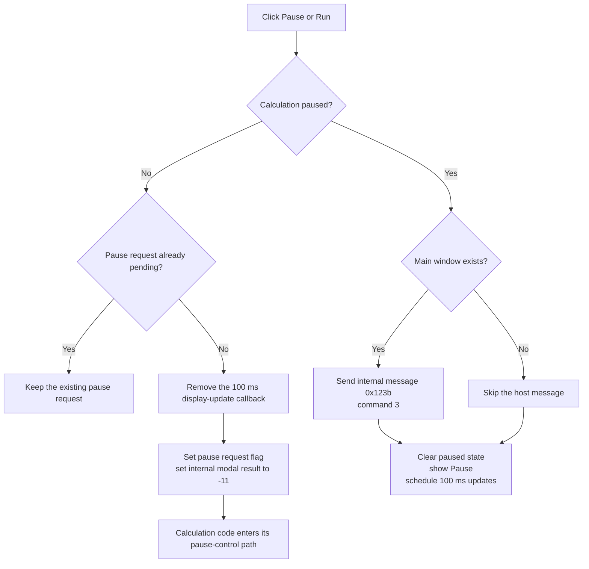

# Pause or resume the calculation

> Analysis status: Reviewed from the recovered click handler, pause-state setters and readers, calculation-side consumer, timer registration and removal paths, caption split helpers, and form resource.

## Control

| Property | Recovered value |
| --- | --- |
| Form | PercentageDlg |
| Form caption | Calculating |
| Component path | PercentageDlg.BtnNotebook.tsCancelPreview.PauseBtn |
| Parent page | tsCancelPreview |
| Control class | TBitBtn |
| Stored caption | Pause\|Run |
| Handler name | PauseBtnClick |
| Handler address | 01af18b0 |
| Graph node | `resource:dfm:PercentageDlg/PercentageDlg.BtnNotebook.tsCancelPreview.PauseBtn` |
| Handler node | `function:01af18b0` |
| Graph layer | UI |

## What happens when clicked

`TPercentageDlg.PauseBtnClick` uses form state `+0x7a0` to select a Pause or Run branch. The form stores the resource caption `Pause|Run` at `+0x7c8` and displays the part that matches the current state.

### Pause a running calculation

When state `+0x7a0` is zero, the calculation is running. If pause request flag `+0x7b2` is clear, the handler:

1. removes the scheduled `FUN_01af1a30` display-update callback;
2. sets the one-shot pause request flag;
3. calls the VCL modal-result setter with internal value `-11`.

Calculation code reads the pause request through `FUN_01af2a50`. A proven consumer, `FUN_01342880`, enters its pause-control path when the flag is set. The external state setter then restores modal result zero, displays the `Run` half of the caption, and marks the form paused.

If the pause request flag is already set, another click does not schedule a second request.

### Resume a paused calculation

When state `+0x7a0` is nonzero, the handler:

1. sends internal message `0x123b`, command `3`, if the global main window exists;
2. clears the paused-state flag;
3. changes the button text to `Pause`, the part before `|`;
4. schedules `FUN_01af1a30` again with a 100 millisecond timer interval.

The periodic callback formats up to six stored progress values and updates the dialog labels while the message page has a created window handle. It then schedules its next run.

## Click flow

## Handler and state evidence

- [FUN_01af18b0](../../../DecompiledSources/Tina16/functions/0000000001AF18B0__FUN_01af18b0.c) implements both branches, removes or adds the display callback, changes the request and state flags, updates the caption, and sends command `3` on resume.
- [FUN_00f834f0](../../../DecompiledSources/Tina16/functions/0000000000F834F0__FUN_00f834f0.c) removes a registered callback from the shared timer service.
- [FUN_00f833f0](../../../DecompiledSources/Tina16/functions/0000000000F833F0__FUN_00f833f0.c) registers the callback with the supplied 100 millisecond interval.
- [FUN_01af1a30](../../../DecompiledSources/Tina16/functions/0000000001AF1A30__FUN_01af1a30.c) formats the stored progress values, updates the six value labels, and reschedules itself.
- [FUN_00648720](../../../DecompiledSources/Tina16/functions/0000000000648720__FUN_00648720.c) returns the caption part before its separator. The resume branch uses it to display `Pause`.
- [FUN_00648780](../../../DecompiledSources/Tina16/functions/0000000000648780__FUN_00648780.c) returns the caption part after its separator. The external paused-state setter uses it to display `Run`.
- [FUN_01af1120](../../../DecompiledSources/Tina16/functions/0000000001AF1120__FUN_01af1120.c) resets the internal modal result, displays `Run`, and sets paused state when the pause request value changes.
- [FUN_01af2a50](../../../DecompiledSources/Tina16/functions/0000000001AF2A50__FUN_01af2a50.c) exposes the pause request flag to calculation code.
- [FUN_01342880](../../../DecompiledSources/Tina16/functions/0000000001342880__FUN_01342880.c) is one proven calculation-side consumer of that flag.

## Resource evidence

- The form caption is `Calculating` and includes a progress gauge and six live value labels.
- `PauseBtn` is on `BtnNotebook.tsCancelPreview` beside Cancel and Preview.
- Its stored caption is `Pause|Run`. The source proves that `|` separates the two state captions.
- The control has no hint, image reference, or extracted glyph.

## State, error, and no-op behavior

- A second Pause click while a pause request is pending does not add another request or timer change.
- In the Run branch, a missing main window skips the host message. The handler still clears paused state, displays `Pause`, and restarts the update timer.
- Timer registration and removal results are not checked.
- The handler has no error message or rollback path.

## Analysis limits

- The calculation that owns the shared dialog decides how it stops and resumes its numerical work. The click handler only maintains shared request state, UI refresh, and the host signal.
- The recovered source does not expose Delphi constant names for modal value `-11` or internal message `0x123b`, command `3`.
