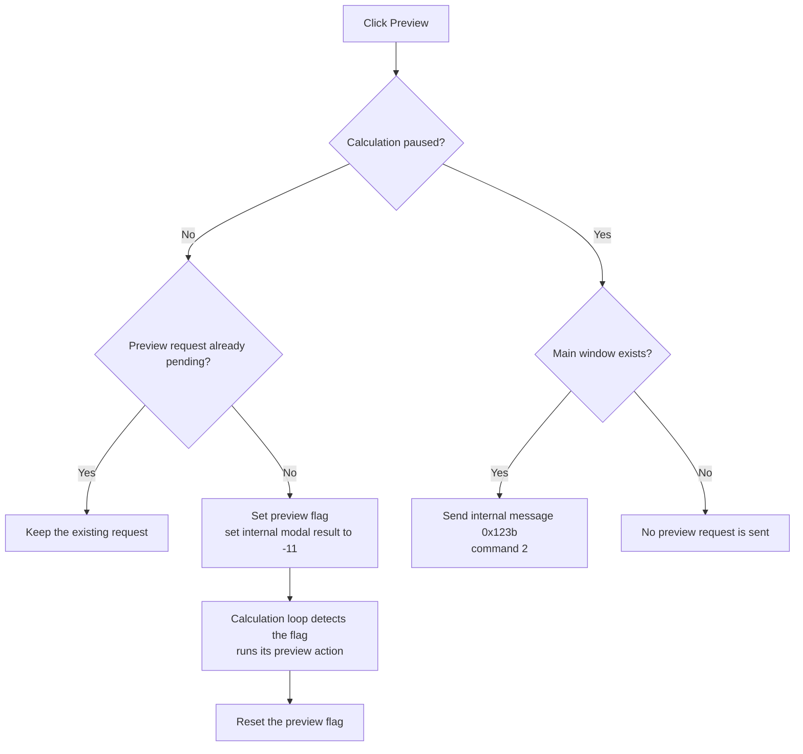

# Request a calculation preview

> Analysis status: Reviewed from the recovered click handler, request-flag accessors, calculation-side consumers, paused-state message path, modal-result setter, and form resource.

## Control

| Property | Recovered value |
| --- | --- |
| Form | PercentageDlg |
| Form caption | Calculating |
| Component path | PercentageDlg.BtnNotebook.tsCancelPreview.PreviewBtn |
| Parent page | tsCancelPreview |
| Control class | TBitBtn |
| Caption | Preview |
| Handler name | PreviewBtnClick |
| Handler address | 01af1240 |
| Graph node | `resource:dfm:PercentageDlg/PercentageDlg.BtnNotebook.tsCancelPreview.PreviewBtn` |
| Handler node | `function:01af1240` |
| Graph layer | UI |

## What happens when clicked

`TPercentageDlg.PreviewBtnClick` requests a preview through one of two paths, based on the form's running or paused state at `+0x7a0`.

While the calculation is running, the handler checks one-shot preview flag `+0x7b1`. If the flag is clear, it sets the flag and calls the VCL modal-result setter with internal value `-11`. Calculation loops read this flag through `FUN_01af2a10`, run their analysis-specific preview action, and reset the flag through `FUN_01af29f0`. A second click while the flag is already set makes no further change.

While the calculation is paused, the handler does not set the one-shot flag. If the global main window exists, it gets the window handle and sends internal message `0x123b` with command `2`. The host owns the preview action for this path.

The click handler only sends the request. It does not calculate or draw preview data itself.

## Click flow

## Handler and consumer evidence

- [FUN_01af1240](../../../DecompiledSources/Tina16/functions/0000000001AF1240__FUN_01af1240.c) branches on running or paused state, guards the one-shot flag, sets internal modal result `-11`, or sends command `2` to the main window.
- [FUN_0064e140](../../../DecompiledSources/Tina16/functions/000000000064E140__FUN_0064e140.c) changes the form modal-result field and sends the VCL modal-result notification only when the value changes.
- [FUN_01af2a10](../../../DecompiledSources/Tina16/functions/0000000001AF2A10__FUN_01af2a10.c) returns the preview request flag to calculation code.
- [FUN_01af29f0](../../../DecompiledSources/Tina16/functions/0000000001AF29F0__FUN_01af29f0.c) forwards a new request-flag value to the form.
- [FUN_01af1100](../../../DecompiledSources/Tina16/functions/0000000001AF1100__FUN_01af1100.c) stores that value and resets the internal modal result to zero when the flag changes.
- [FUN_013236d0](../../../DecompiledSources/Tina16/functions/00000000013236D0__FUN_013236d0.c) is one proven consumer: it detects the preview flag, prepares its preview output, and resets the flag.
- [FUN_0065b870](../../../DecompiledSources/Tina16/functions/000000000065B870__FUN_0065b870.c) returns the main window handle for the paused-state message.

## Resource evidence

- The form caption is `Calculating` and includes a progress gauge and live calculation labels.
- `PreviewBtn` is on `BtnNotebook.tsCancelPreview` beside Cancel and Pause or Run.
- The caption is `Preview`. The control has no hint, image reference, or extracted glyph.

## State, error, and no-op behavior

- A pending running-state request is not queued again.
- In paused state, a missing main window makes the click a no-op.
- The internal message result is ignored.
- The handler has no preview result, error message, retry, or rendering path.

## Analysis limits

- Different calculation loops perform different preview operations after they read the shared flag. The button does not identify a single preview implementation.
- The recovered source does not expose a Delphi constant name for modal value `-11` or internal message `0x123b`, command `2`.
