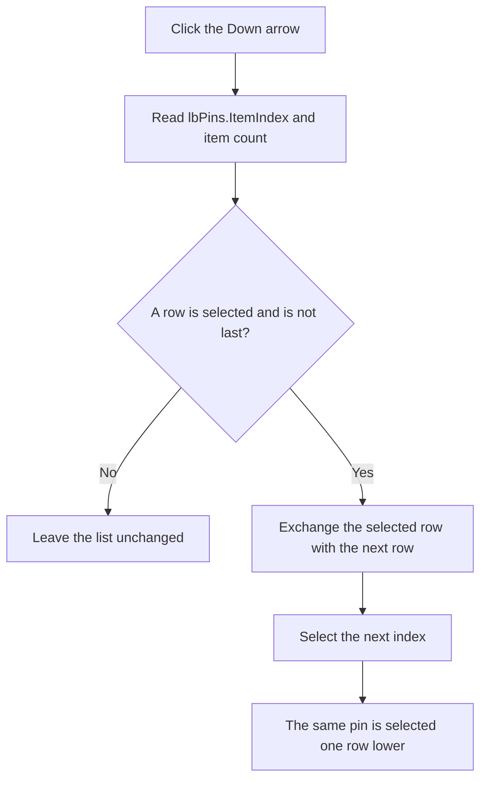

# Move the selected pin one row down

> Analysis status: Source and call path reviewed.

## Control

| Property | Recovered value |
| --- | --- |
| Form | PinOrderDlg |
| Component path | PinOrderDlg.Down |
| Control class | TBitBtn |
| Caption | Not present in the recovered resource. |
| Handler name | DownClick |
| Handler address | 01781890 |
| Graph node | `resource:dfm:PinOrderDlg/PinOrderDlg.Down` |
| Handler node | `function:01781890` |
| Graph layer | UI |

## What happens when clicked

The handler gets the current item index from `PinOrderDlg.lbPins`. If an item is selected and it is not the last row, the handler exchanges that list entry with the entry at the next index. It then sets the selected index to the next index. Thus, the moved pin remains selected after it moves down by one row.

The click is a no-op when there is no selection or when the selected pin is already at the bottom. It does not move more than one row, sort the list, change a pin name, or edit a pin property.

The list is owner-drawn. Its draw handler gets the object that is associated with each row and uses object flag bit `0x04` at offset `+0x145` to select one of two drawing states. The dialog's idle handler uses the same bit to control whether the arrow buttons are enabled. For Down, it disables the button at the bottom, without a selection, and when an unflagged current row is directly above a flagged row. This prevents a normal UI click from crossing that recovered category boundary.

`DownClick` itself does not test the object flag or the button's enabled state. A direct programmatic handler call can therefore exchange any adjacent rows that pass the index test.

## Working-state boundary

This handler changes the order in the dialog's `lbPins` list only. It has no direct model, file, registry, or device call. The DFM provides separate `bkOK` and `bkCancel` buttons without recovered click handlers. The recovered graph does not connect this list exchange to the caller's post-dialog commit, so the exact persistence of the accepted order remains outside the recovered handler boundary.

## Click flow

## Handler evidence

- [Down click handler](../../../DecompiledSources/Tina16/functions/0000000001781890__FUN_01781890.c): reads the selected index and list count, exchanges indices `i` and `i + 1`, and selects `i + 1`.
- [Idle-state handler](../../../DecompiledSources/Tina16/functions/0000000001781920__FUN_01781920.c): disables Down at the list boundary, without a selection, and at the recovered object-flag boundary.
- [Owner-draw handler](../../../DecompiledSources/Tina16/functions/0000000001781AB0__FUN_01781ab0.c): reads the object associated with each list row and changes its drawing state from object flag bit `0x04`.
- [Form-create handler](../../../DecompiledSources/Tina16/functions/0000000001781BB0__FUN_01781bb0.c): configures list drawing dimensions but does not perform the row move.

The knowledge graph has no direct call edge because the handler invokes the list box and its item collection through Delphi virtual methods.

## Resource evidence

- Form caption: `Pin Order`.
- The list control is `PinOrderDlg.lbPins`, class `TListBox`, with `lbOwnerDrawFixed` style.
- Instruction label: `Select and move with the arrows the pin to its desired place.` The remaining label text explains that unnamed pins appear as `(pin X)` and must be named in the editor.
- NumGlyphs: `2`.
- [Extracted Down glyph](../../../glyph/0306_PinOrderDlg_PinOrderDlg_Down_Glyph_Data.png): contains the recovered downward-arrow states.
- UI evidence: [Recovered DFM resource data](../../../DecompiledSources/Tina16/resources/dfm/ui-evidence.json).

The label and glyph agree with the direction, but the source proves the exact one-row exchange and selection behavior.

## Analysis limits

- Object flag bit `0x04` controls the recovered boundary and draw state. Its Delphi field name and category name are not recovered.
- The post-OK consumer that copies the working list order to the pin model is not connected in the recovered graph.
- The handler has no local exception recovery or rollback around the virtual list operations.
