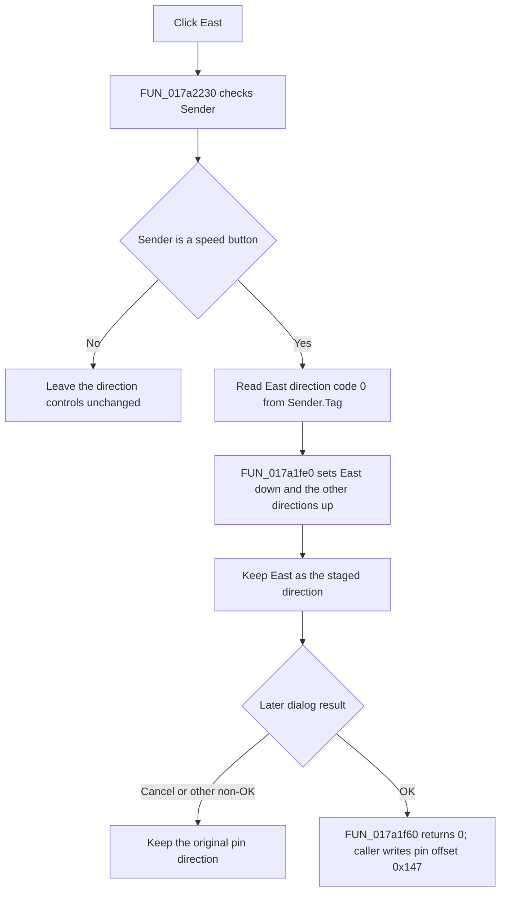

# btnEast

> Analysis status: Reviewed from recovered shared-handler, state, caller, resource, and glyph evidence.

## Control

| Property | Recovered value |
| --- | --- |
| Form | PinProps |
| Component path | PinProps.btnEast |
| Control class | TSpeedButton |
| Caption | Not present in the recovered resource. |
| Hint | Not present in the recovered resource. |
| Text | Not present in the recovered resource. |
| Handler name | DirClick |
| Handler address | 017a2230 |
| Graph node | `resource:dfm:PinProps/PinProps.btnEast` |
| Handler node | `function:017a2230` |
| Graph layer | UI |

## What happens when clicked

`FUN_017a2230` first verifies that `Sender` is a speed button. For `PinProps.btnEast`, it reads direction code 0 from the sender's `Tag` byte and passes that code to `FUN_017a1fe0`.

The helper sets the East button's `Down` state to true and sets North, South, and West to false. `FUN_017a1fc0` avoids a setter call when a button already has the requested state. Repeated East clicks therefore leave East selected and do not leave all four buttons up, even though the recovered speed buttons have `AllowAllUp = true`.

This click changes only the staged direction controls in the dialog. It does not write the edited pin record, close the dialog, or refresh the schematic.

## Shared direction mapping and commit boundary

All four direction buttons use the same `DirClick` handler and `GroupIndex = 1`. The recovered button fields, setter, and reader establish this direction-code mapping:

| Button | Direction code |
| --- | --- |
| East | 0 |
| South | 1 |
| West | 2 |
| North | 3 |

`FUN_017b0ee0` initializes the button group from the pin record byte at offset `0x147` before it shows the dialog. If the modal result is OK, it calls `FUN_017a1f60`, writes the selected direction code back to that byte, copies the other edited properties, and refreshes the owner. A non-OK result skips these writes.

## No-op and unsupported paths

A null or non-speed-button `Sender` fails the recovered class test and causes no change. A speed button with a direction code outside 0 through 3 would make `FUN_017a1fe0` clear all four buttons. The four recovered direction controls use the valid mapping above. The handler has no validation message, local exception handler, or model rollback because it does not modify the model.

## Click flow

## Handler evidence

- Source: [DecompiledSources/Tina16/functions/00000000017A2230__FUN_017a2230.c](../../../DecompiledSources/Tina16/functions/00000000017A2230__FUN_017a2230.c)
- Recovered role: Route a direction speed-button click to the PinProps direction-state setter.
- Current graph summary: Handles 4 Delphi UI events: PinProps.btnNorth.OnClick, PinProps.btnEast.OnClick, PinProps.btnSouth.OnClick.
- Current graph behavior: Validates `Sender` as a speed button, reads its direction code, and sets exactly the matching direction button down for codes 0 through 3. This control supplies East code 0.
- Current graph evidence: `FUN_017a2230` class-checks `Sender`, reads its byte at `+0x18`, and calls `FUN_017a1fe0`. The setter maps code 0 to the form field for btnEast, while `FUN_017a1f60` returns 0 when that button is down. The extracted glyph and Direction label agree with the East control identity.
- Complexity: moderate
- Distinct outgoing calls: 2

## Direct calls

- `function:004113d0` — Test whether `Sender` is a compatible speed-button instance.
- `function:017a1fe0` — Apply one direction code to all four speed-button down states.

## Related source

- [Direction-state setter `FUN_017a1fe0`](../../../DecompiledSources/Tina16/functions/00000000017A1FE0__FUN_017a1fe0.c) — Maps codes 0 through 3 to East, South, West, and North.
- [Set-if-changed helper `FUN_017a1fc0`](../../../DecompiledSources/Tina16/functions/00000000017A1FC0__FUN_017a1fc0.c) — Changes a speed-button down state only when needed.
- [Direction-state reader `FUN_017a1f60`](../../../DecompiledSources/Tina16/functions/00000000017A1F60__FUN_017a1f60.c) — Returns the code for the button that is down.
- [Pin-properties coordinator `FUN_017b0ee0`](../../../DecompiledSources/Tina16/functions/00000000017B0EE0__FUN_017b0ee0.c) — Initializes the staged direction and commits it only after OK.

## Resource evidence

- Kind: Not present in the recovered resource.
- Modal result: Not present in the recovered resource.
- Checked state: Not present in the recovered resource.
- List items: Not present in the recovered resource.
- Image reference: Not present in the recovered resource.
- Extracted glyph: [`0308_PinProps_PinProps_btnEast_Glyph_Data.png`](../../../glyph/0308_PinProps_PinProps_btnEast_Glyph_Data.png)

## Nearby label candidates

Nearby labels are layout candidates only. They are not proof of behavior.

- Rank 1: &Direction: at distance 89.
- Rank 2: Name Color: at distance 116.
- Rank 3: S&hape: at distance 118.

## Analysis limits

- The extracted DFM subset does not expose the buttons' `Tag` property. The effective codes are established by the shared setter, reader, contiguous button fields, control identities, and inspected glyphs.
- The caller owns the later model update. It is commit-boundary evidence and is not assigned to this click handler.
- The East fragment owns the canonical shared helper annotations. The other three fragments repeat only the shared handler scalars so annotation imports remain conflict-free.
