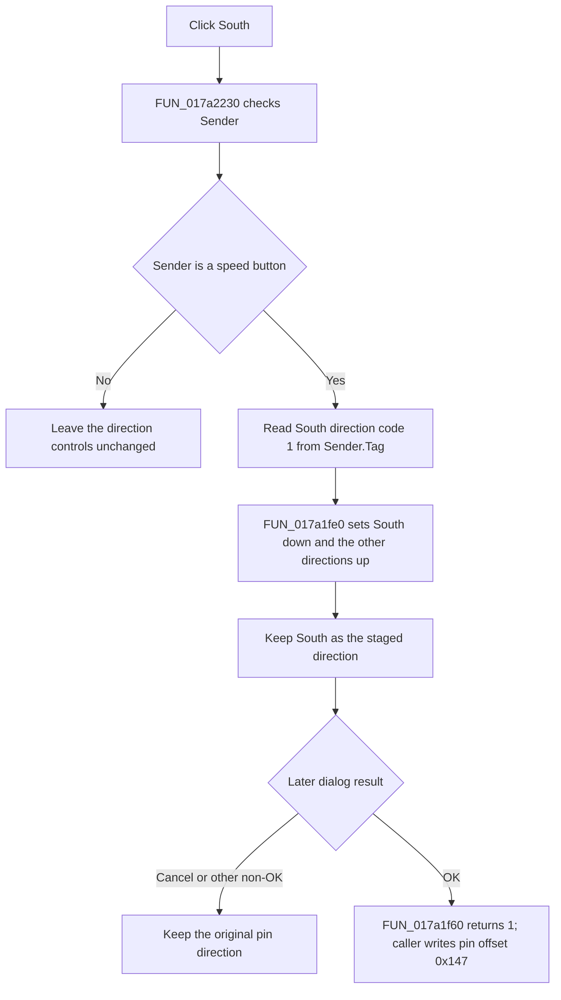

# btnSouth

> Analysis status: Reviewed from recovered shared-handler, state, caller, resource, and glyph evidence.

## Control

| Property | Recovered value |
| --- | --- |
| Form | PinProps |
| Component path | PinProps.btnSouth |
| Control class | TSpeedButton |
| Caption | Not present in the recovered resource. |
| Hint | Not present in the recovered resource. |
| Text | Not present in the recovered resource. |
| Handler name | DirClick |
| Handler address | 017a2230 |
| Graph node | `resource:dfm:PinProps/PinProps.btnSouth` |
| Handler node | `function:017a2230` |
| Graph layer | UI |

## What happens when clicked

`FUN_017a2230` verifies that `Sender` is a speed button. For `PinProps.btnSouth`, it reads direction code 1 from the sender's `Tag` byte and passes that code to `FUN_017a1fe0`.

The helper sets South down and sets North, East, and West up. `FUN_017a1fc0` skips setter calls for buttons that already have the requested state. A repeated South click therefore keeps South selected, despite `AllowAllUp = true` in the recovered resource.

This is staged dialog state only. The click does not modify the pin record, close the dialog, or refresh the schematic.

## Shared state and later commit

The four direction buttons share `DirClick` and `GroupIndex = 1`. Their recovered codes are East 0, South 1, West 2, and North 3. The dialog coordinator initializes them from pin-record offset `0x147`. After OK, `FUN_017a1f60` returns 1 for South, and the coordinator writes that code back with the other properties and refreshes the owner. Cancel or another non-OK result skips the writes.

A null or non-speed-button `Sender` is a no-op. An unsupported direction code would clear the whole group. No validation message or local error handler is recovered.

## Click flow

## Handler evidence

- Source: [DecompiledSources/Tina16/functions/00000000017A2230__FUN_017a2230.c](../../../DecompiledSources/Tina16/functions/00000000017A2230__FUN_017a2230.c)
- Recovered role: Route a direction speed-button click to the PinProps direction-state setter.
- Current graph summary: Handles 4 Delphi UI events: PinProps.btnNorth.OnClick, PinProps.btnEast.OnClick, PinProps.btnSouth.OnClick.
- Current graph behavior: Validates `Sender` as a speed button, reads its direction code, and sets exactly the matching direction button down for codes 0 through 3. This control supplies South code 1.
- Current graph evidence: `FUN_017a2230` class-checks `Sender`, reads its byte at `+0x18`, and calls `FUN_017a1fe0`. The setter maps code 1 to the form field for btnSouth, while `FUN_017a1f60` returns 1 when that button is down. The extracted glyph and Direction label agree with the South control identity.
- Complexity: moderate
- Distinct outgoing calls: 2

## Direct calls

- `function:004113d0` — Test whether `Sender` is a compatible speed-button instance.
- `function:017a1fe0` — Apply one direction code to all four speed-button down states.

## Related source

- [Direction-state setter `FUN_017a1fe0`](../../../DecompiledSources/Tina16/functions/00000000017A1FE0__FUN_017a1fe0.c) — Maps codes 0 through 3 to East, South, West, and North.
- [Direction-state reader `FUN_017a1f60`](../../../DecompiledSources/Tina16/functions/00000000017A1F60__FUN_017a1f60.c) — Returns the code for the button that is down.
- [Pin-properties coordinator `FUN_017b0ee0`](../../../DecompiledSources/Tina16/functions/00000000017B0EE0__FUN_017b0ee0.c) — Initializes the staged direction and commits it only after OK.

## Resource evidence

- Kind: Not present in the recovered resource.
- Modal result: Not present in the recovered resource.
- Checked state: Not present in the recovered resource.
- List items: Not present in the recovered resource.
- Image reference: Not present in the recovered resource.
- Extracted glyph: [`0309_PinProps_PinProps_btnSouth_Glyph_Data.png`](../../../glyph/0309_PinProps_PinProps_btnSouth_Glyph_Data.png)

## Nearby label candidates

Nearby labels are layout candidates only. They are not proof of behavior.

- Rank 1: &Length: at distance 110.
- Rank 2: &Direction: at distance 116.
- Rank 3: Name Color: at distance 143.

## Analysis limits

- The DFM evidence subset omits the buttons' `Tag` property. The code mapping, button fields, names, Direction label, and inspected glyph establish the effective control-specific code.
- The caller owns the later model update and is used only to establish the commit boundary.
- Shared helper annotations are owned by the East fragment to avoid unnecessary duplicate annotation sources.
