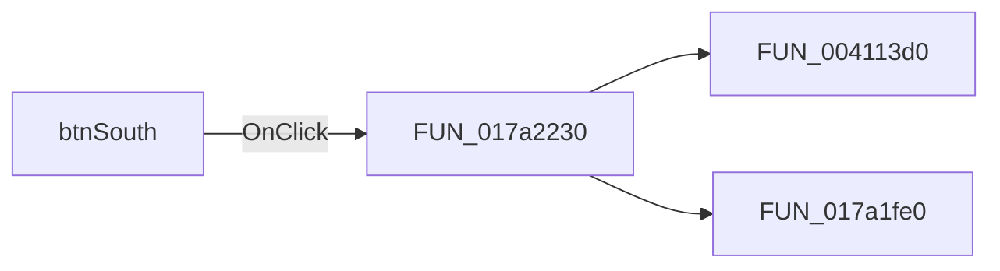

# btnSouth

> Analysis status: Pending individual source review.

## Control

| Property | Recovered value |
| --- | --- |
| Form | PinProps |
| Component path | PinProps.btnSouth |
| Control class | TSpeedButton |
| Caption | Not present in the recovered resource. |
| Hint | Not present in the recovered resource. |
| Text | Not present in the recovered resource. |
| Handler name | DirClick |
| Handler address | 017a2230 |
| Graph node | `resource:dfm:PinProps/PinProps.btnSouth` |
| Handler node | `function:017a2230` |
| Graph layer | UI |

## What happens when clicked

Pending individual analysis. An agent must read the recovered handler source and its relevant callees before it replaces this text.

## Click flow

## Handler evidence

- Source: [DecompiledSources/Tina16/functions/00000000017A2230__FUN_017a2230.c](../../../DecompiledSources/Tina16/functions/00000000017A2230__FUN_017a2230.c)
- Recovered role: Not present in the recovered resource.
- Current graph summary: Handles 4 Delphi UI events: PinProps.btnNorth.OnClick, PinProps.btnEast.OnClick, PinProps.btnSouth.OnClick.
- Current graph behavior: Not present in the recovered resource.
- Current graph evidence: Not present in the recovered resource.
- Complexity: moderate
- Distinct outgoing calls: 2

## Direct calls

- `function:004113d0` — FUN_004113d0
- `function:017a1fe0` — FUN_017a1fe0

## Resource evidence

- Kind: Not present in the recovered resource.
- Modal result: Not present in the recovered resource.
- Checked state: Not present in the recovered resource.
- List items: Not present in the recovered resource.
- Image reference: Not present in the recovered resource.
- Extracted glyph: [`0309_PinProps_PinProps_btnSouth_Glyph_Data.png`](../../../glyph/0309_PinProps_PinProps_btnSouth_Glyph_Data.png)

## Nearby label candidates

Nearby labels are layout candidates only. They are not proof of behavior.

- Rank 1: &Length: at distance 110.
- Rank 2: &Direction: at distance 116.
- Rank 3: Name Color: at distance 143.

## Analysis limits

- Do not infer behavior from the control class, caption, hint, glyph, or nearby label alone.
- Do not replace the pending status until the handler source and relevant call path provide enough evidence.
