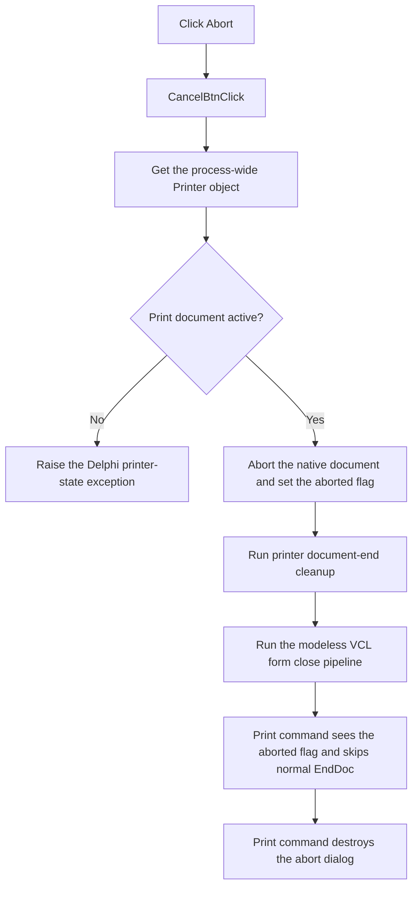

# Abort printing

> Analysis status: Evidence-backed source review complete.

## Control

| Property | Recovered value |
| --- | --- |
| Form | PrinterAbortDlg |
| Component path | PrinterAbortDlg.CancelBtn |
| Control class | TBitBtn |
| Caption | Not present in the recovered resource. |
| Hint | Not present in the recovered resource. |
| Text | Not present in the recovered resource. |
| Handler name | CancelBtnClick |
| Handler address | 01800670 |
| Graph node | `resource:dfm:PrinterAbortDlg/PrinterAbortDlg.CancelBtn` |
| Handler node | `function:01800670` |
| Graph layer | UI |

## What happens when clicked

`FUN_01800670` ignores the `Sender` value. It gets the process-wide Delphi `Printer` object through `FUN_0069e8a0`, calls its abort operation `FUN_0069d550`, and then calls the VCL form close routine `FUN_00805200` on `PrinterAbortDlg`.

The printer abort routine first verifies that a document is printing. It obtains the printer canvas and its native handle, requests the underlying document abort, sets the printer's aborted flag at offset `+0x39`, and runs the shared document-end cleanup. It sets the aborted flag again after cleanup. The print command reads this same flag when page rendering returns. A set flag makes that command skip its normal `EndDoc` call.

The printing command creates `PrinterAbortDlg` as a modeless form after `BeginDoc`, fills its file and printer labels, shows it, and processes application messages. Therefore, this button operates during an active print job in the recovered workflow. The close call uses the normal modeless VCL close-query and close-action pipeline. The handler does not free the form. The printing command destroys the form and clears its global pointer after the print loop returns.

There is no alternate or no-op branch in the click handler. The printer routine raises a Delphi exception when its active-print check fails, and the click handler has no local exception handler. A close query can also reject the dialog close after the printer job has already been aborted. The recovered page renderer does not test the abort flag between page-loop iterations, so the source does not prove the exact page on which the native print system stops output.

## Click flow

## Handler evidence

- Source: [DecompiledSources/Tina16/functions/0000000001800670__FUN_01800670.c](../../../DecompiledSources/Tina16/functions/0000000001800670__FUN_01800670.c)
- Recovered role: Aborts the active print job and closes its modeless progress dialog.
- Current graph summary: Handles 1 Delphi UI event: PrinterAbortDlg.CancelBtn.OnClick.
- Current graph behavior: Not present in the recovered resource.
- Current graph evidence: Not present in the recovered resource.
- Complexity: complex
- Distinct outgoing calls: 3

## Direct calls

- `function:0069e8a0` — returns the lazily created process-wide Delphi `Printer` object.
- `function:0069d550` — validates active printing, aborts the native document, marks the printer aborted, and ends printer state.
- `function:00805200` — runs the VCL form close-query and close-action pipeline.

## Caller and state evidence

- [DFWindow print handler](../../../DecompiledSources/Tina16/functions/0000000001A7AB10__FUN_01a7ab10.c) gets the same global printer, calls `BeginDoc`, creates and shows `PrinterAbortDlg`, processes application messages, and reads printer offset `+0x39` after rendering. It calls normal `EndDoc` only when that flag is clear.
- [Printer abort routine](../../../DecompiledSources/Tina16/functions/000000000069D550__FUN_0069d550.c) sets offset `+0x39` before and after it calls the document-end helper.
- [Printer singleton getter](../../../DecompiledSources/Tina16/functions/000000000069E8A0__FUN_0069e8a0.c) creates the global object only when its stored pointer is null.
- [VCL form close routine](../../../DecompiledSources/Tina16/functions/0000000000805200__FUN_00805200.c) performs the close query and dispatches the selected close action for a modeless form.

## Resource evidence

- Kind: bkAbort
- Modal result: Not present in the recovered resource.
- Checked state: Not present in the recovered resource.
- List items: Not present in the recovered resource.
- Image reference: Not present in the recovered resource.
- Extracted glyph: None.

## Nearby label candidates

Nearby labels are layout candidates only. They are not proof of behavior.

- Rank 1: [printer] at distance 81.
- Rank 2: on at distance 96.
- Rank 3: [file] at distance 111.
- Rank 4: Printing at distance 126.

## Evidence limits

- The recovered imported thunk inside the printer routine has no API name. Its position between the printer-handle lookup and the aborted-flag write, the surrounding `TPrinter` state transitions, and the print caller's flag test establish the document-abort role. The exact native return value is not recovered.
- The source does not show a local user-facing error message, retry, or rollback path.
- The `bkAbort` resource kind agrees with the proven handler path, but it is not the basis for the behavior claim.
