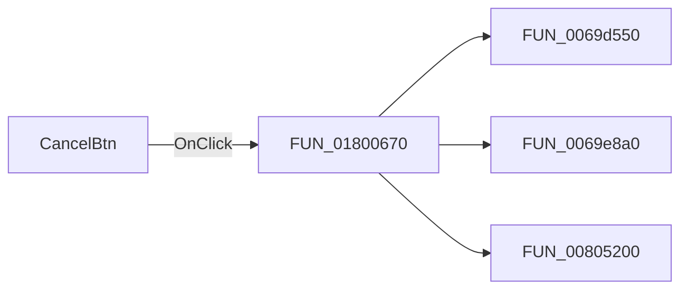

# CancelBtn

> Analysis status: Pending individual source review.

## Control

| Property | Recovered value |
| --- | --- |
| Form | PrinterAbortDlg |
| Component path | PrinterAbortDlg.CancelBtn |
| Control class | TBitBtn |
| Caption | Not present in the recovered resource. |
| Hint | Not present in the recovered resource. |
| Text | Not present in the recovered resource. |
| Handler name | CancelBtnClick |
| Handler address | 01800670 |
| Graph node | `resource:dfm:PrinterAbortDlg/PrinterAbortDlg.CancelBtn` |
| Handler node | `function:01800670` |
| Graph layer | UI |

## What happens when clicked

Pending individual analysis. An agent must read the recovered handler source and its relevant callees before it replaces this text.

## Click flow

## Handler evidence

- Source: [DecompiledSources/Tina16/functions/0000000001800670__FUN_01800670.c](../../../DecompiledSources/Tina16/functions/0000000001800670__FUN_01800670.c)
- Recovered role: Not present in the recovered resource.
- Current graph summary: Handles 1 Delphi UI event: PrinterAbortDlg.CancelBtn.OnClick.
- Current graph behavior: Not present in the recovered resource.
- Current graph evidence: Not present in the recovered resource.
- Complexity: complex
- Distinct outgoing calls: 3

## Direct calls

- `function:0069d550` — FUN_0069d550
- `function:0069e8a0` — FUN_0069e8a0
- `function:00805200` — FUN_00805200

## Resource evidence

- Kind: bkAbort
- Modal result: Not present in the recovered resource.
- Checked state: Not present in the recovered resource.
- List items: Not present in the recovered resource.
- Image reference: Not present in the recovered resource.
- Extracted glyph: None.

## Nearby label candidates

Nearby labels are layout candidates only. They are not proof of behavior.

- Rank 1: [printer] at distance 81.
- Rank 2: on at distance 96.
- Rank 3: [file] at distance 111.

## Analysis limits

- Do not infer behavior from the control class, caption, hint, glyph, or nearby label alone.
- Do not replace the pending status until the handler source and relevant call path provide enough evidence.
