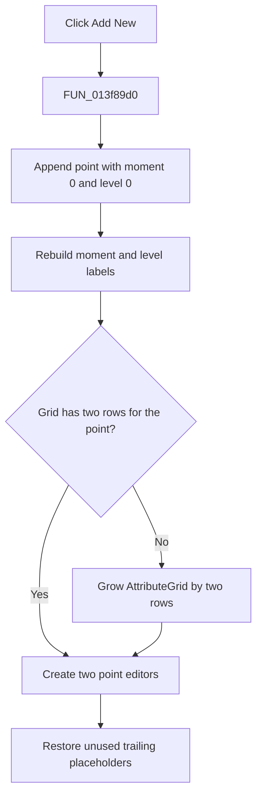

# A&dd New

> Analysis status: Evidence-backed source review complete.

## Control

| Property | Recovered value |
| --- | --- |
| Form | PsgForm |
| Component path | PsgForm.AddNew |
| Control class | TBitBtn |
| Caption | A&dd New |
| Hint | Not present in the recovered resource. |
| Text | Not present in the recovered resource. |
| Handler name | AddNewClick |
| Handler address | 013f89d0 |
| Graph node | `resource:dfm:PsgForm/PsgForm.AddNew` |
| Handler node | `function:013f89d0` |
| Graph layer | UI |

## What happens when clicked

`FUN_013f89d0` appends one point to the working pulse-generator sequence at form field `+0x750`. The new point starts with moment value `0` and level value `0`.

The handler rebuilds the moment and level row labels, grows the AttributeGrid by two rows when the current allocation is too small, and creates the two editor objects for the new point. It then restores the unused trailing rows to the localized placeholder state.

There is no maximum-count guard, confirmation, local error message, or rollback. The original pulse-generator object is not changed here; the valid working sequence is copied back only by OK.

## Click flow

## Handler evidence

- Source: [DecompiledSources/Tina16/functions/00000000013F89D0__FUN_013f89d0.c](../../../DecompiledSources/Tina16/functions/00000000013F89D0__FUN_013f89d0.c)
- Recovered role: Append a default moment/level point to the working pulse sequence.
- Current graph summary: Handles 1 Delphi UI event: PsgForm.AddNew.OnClick.
- Current graph behavior: Adds point `(0, 0)`, refreshes row labels, ensures two grid rows are available, and binds editor objects for the new point.
- Current graph evidence: The handler calls `FUN_01d3aad0` on model `+0x750` with two zero values, derives two grid row indexes from the new model count, and passes moment and level editor objects to `FUN_00b0ab70`.
- Complexity: complex
- Distinct outgoing calls: 12

## Direct calls

- `function:00414560` — Delphi UnicodeString array finalization helper
- `function:00848a70` — changes the AttributeGrid row count when more capacity is required.
- `function:0084e3e0` — writes localized placeholder text into unused grid cells.
- `function:00b0ab70` — attaches an editor object to the next AttributeGrid row.
- `function:00b89270` — FUN_00b89270
- `function:00b8e520` — FUN_00b8e520
- `function:00b909d0` — FUN_00b909d0
- `function:013f76a0` — rebuilds the alternating moment and level row labels for the working sequence.
- `function:01430100` — FUN_01430100
- `function:014313c0` — FUN_014313c0
- `function:01d3aab0` — FUN_01d3aab0
- `function:01d3aad0` — appends one moment/level record to the working sequence.

## Resource evidence

- Kind: Not present in the recovered resource.
- Modal result: Not present in the recovered resource.
- Checked state: Not present in the recovered resource.
- List items: Not present in the recovered resource.
- Image reference: Not present in the recovered resource.
- Extracted glyph: None.

## Nearby label candidates

Nearby labels are layout candidates only. They are not proof of behavior.

- Rank 1: Repeat from:  at distance 230.

## Analysis limits

- The recovered editor-class names and level-zero display text are not available.
- The distant **Repeat from:** label does not describe this button and is not used as behavioral evidence.
