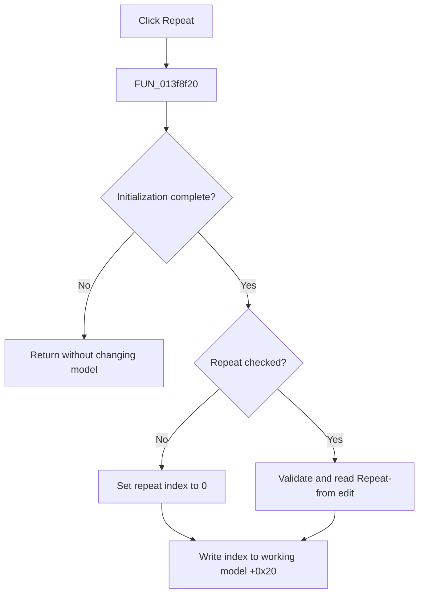

# R&epeat

> Analysis status: Evidence-backed source review complete.

## Control

| Property | Recovered value |
| --- | --- |
| Form | PsgForm |
| Component path | PsgForm.cbRepeat |
| Control class | TCheckBox |
| Caption | R&epeat |
| Hint | Not present in the recovered resource. |
| Text | Not present in the recovered resource. |
| Handler name | cbRepeatClick |
| Handler address | 013f8f20 |
| Graph node | `resource:dfm:PsgForm/PsgForm.cbRepeat` |
| Handler node | `function:013f8f20` |
| Graph layer | UI |

## What happens when clicked

`FUN_013f8f20` updates repeat metadata only after form initialization flag `+0x741` is set. This guard prevents initialization-time checkbox changes from modifying the working model.

After initialization, an unchecked Repeat box sets form repeat index `+0x760` to `0`. A checked box validates and reads the integer editor at `+0x718` and stores that Repeat-from value instead. The handler then copies the chosen index to repeat field `+0x20` in working model `+0x750`.

This click does not copy the working model to the original generator; OK performs that step. Invalid editor text or range uses the standard TIntEdit validation path. The handler has no local recovery branch and does not use `Sender`.

## Click flow

## Handler evidence

- Source: [DecompiledSources/Tina16/functions/00000000013F8F20__FUN_013f8f20.c](../../../DecompiledSources/Tina16/functions/00000000013F8F20__FUN_013f8f20.c)
- Recovered role: Enable or disable repetition in the working pulse sequence.
- Current graph summary: Handles 1 Delphi UI event: PsgForm.cbRepeat.OnClick.
- Current graph behavior: After initialization, maps unchecked state to repeat index `0` and checked state to the validated Repeat-from integer, then updates the working model.
- Current graph evidence: The handler tests flag `+0x741`, reads checkbox state through VMT slot `+0x260`, calls `FUN_00f04d50` only for the checked state, writes form field `+0x760`, and copies it to model field `+0x20`.
- Complexity: simple
- Distinct outgoing calls: 1

## Direct calls

- `function:00f04d50` — validates and returns the TIntEdit Repeat-from value.

## Resource evidence

- Kind: Not present in the recovered resource.
- Modal result: Not present in the recovered resource.
- Checked state: Not present in the recovered resource.
- List items: Not present in the recovered resource.
- Image reference: Not present in the recovered resource.
- Extracted glyph: None.

## Nearby label candidates

Nearby labels are layout candidates only. They are not proof of behavior.

- Rank 1: Repeat from:  at distance 25.

## Analysis limits

- The valid minimum and maximum values are held in the TIntEdit object but were not exported as resource properties.
- The nearby **Repeat from:** label supports the editor association; the state branch and model write establish the behavior.
