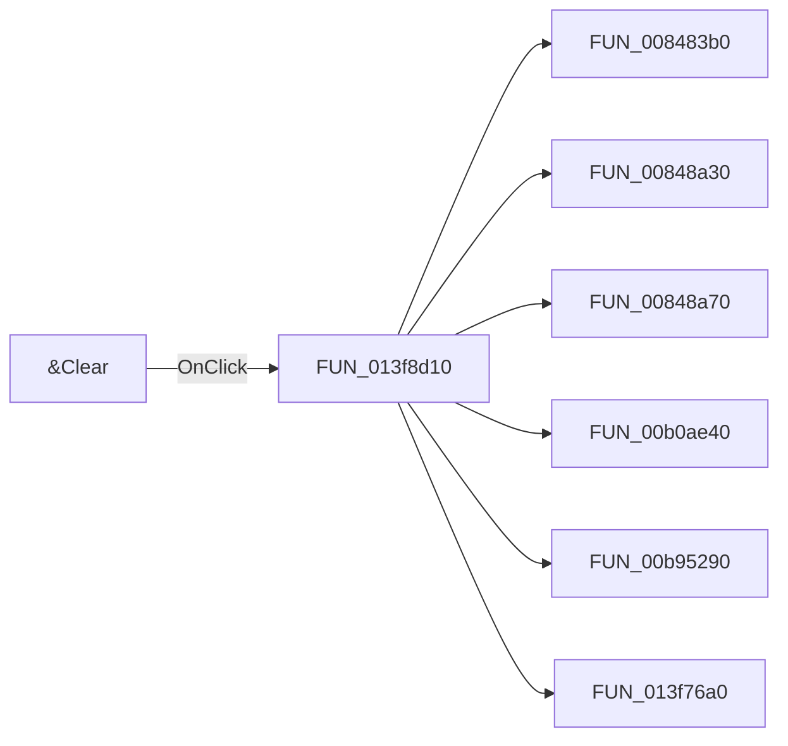

# &Clear

> Analysis status: Pending individual source review.

## Control

| Property | Recovered value |
| --- | --- |
| Form | PsgForm |
| Component path | PsgForm.Clear |
| Control class | TButton |
| Caption | &Clear |
| Hint | Not present in the recovered resource. |
| Text | Not present in the recovered resource. |
| Handler name | ClearClick |
| Handler address | 013f8d10 |
| Graph node | `resource:dfm:PsgForm/PsgForm.Clear` |
| Handler node | `function:013f8d10` |
| Graph layer | UI |

## What happens when clicked

Pending individual analysis. An agent must read the recovered handler source and its relevant callees before it replaces this text.

## Click flow

## Handler evidence

- Source: [DecompiledSources/Tina16/functions/00000000013F8D10__FUN_013f8d10.c](../../../DecompiledSources/Tina16/functions/00000000013F8D10__FUN_013f8d10.c)
- Recovered role: Not present in the recovered resource.
- Current graph summary: Handles 1 Delphi UI event: PsgForm.Clear.OnClick.
- Current graph behavior: Not present in the recovered resource.
- Current graph evidence: Not present in the recovered resource.
- Complexity: complex
- Distinct outgoing calls: 8

## Direct calls

- `function:008483b0` — FUN_008483b0
- `function:00848a30` — FUN_00848a30
- `function:00848a70` — FUN_00848a70
- `function:00b0ae40` — FUN_00b0ae40
- `function:00b95290` — FUN_00b95290
- `function:013f76a0` — FUN_013f76a0
- `function:013f7aa0` — FUN_013f7aa0
- `function:01d3aad0` — FUN_01d3aad0

## Resource evidence

- Kind: Not present in the recovered resource.
- Modal result: Not present in the recovered resource.
- Checked state: Not present in the recovered resource.
- List items: Not present in the recovered resource.
- Image reference: Not present in the recovered resource.
- Extracted glyph: None.

## Nearby label candidates

Nearby labels are layout candidates only. They are not proof of behavior.

- Rank 1: Repeat from:  at distance 142.

## Analysis limits

- Do not infer behavior from the control class, caption, hint, glyph, or nearby label alone.
- Do not replace the pending status until the handler source and relevant call path provide enough evidence.
