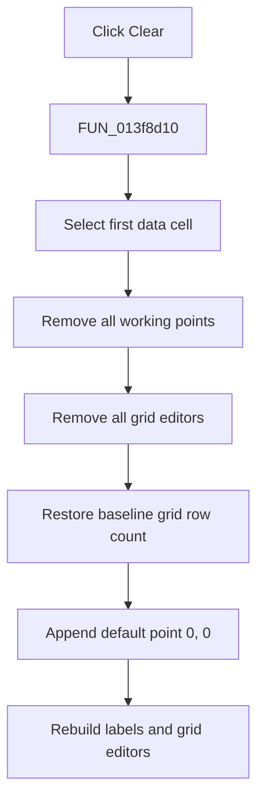

# &Clear

> Analysis status: Evidence-backed source review complete.

## Control

| Property | Recovered value |
| --- | --- |
| Form | PsgForm |
| Component path | PsgForm.Clear |
| Control class | TButton |
| Caption | &Clear |
| Hint | Not present in the recovered resource. |
| Text | Not present in the recovered resource. |
| Handler name | ClearClick |
| Handler address | 013f8d10 |
| Graph node | `resource:dfm:PsgForm/PsgForm.Clear` |
| Handler node | `function:013f8d10` |
| Graph layer | UI |

## What happens when clicked

`FUN_013f8d10` resets the working pulse sequence and AttributeGrid. It selects the first data cell, removes all working model records and grid editor objects, restores the configured baseline row count, and appends one default point with moment `0` and level `0`.

It then rebuilds the alternating moment and level labels and binds the grid to the new one-point model. The current file name and repeat settings are not changed by this handler. The original generator is also unchanged until OK applies the working copy.

The operation has no confirmation, local error branch, or rollback.

## Click flow

## Handler evidence

- Source: [DecompiledSources/Tina16/functions/00000000013F8D10__FUN_013f8d10.c](../../../DecompiledSources/Tina16/functions/00000000013F8D10__FUN_013f8d10.c)
- Recovered role: Reset the working pulse sequence to one default point.
- Current graph summary: Handles 1 Delphi UI event: PsgForm.Clear.OnClick.
- Current graph behavior: Clears the model and grid editors, restores the baseline grid size, adds point `(0, 0)`, and rebuilds the grid from that model.
- Current graph evidence: The handler calls `FUN_00b95290` on model `+0x750`, `FUN_00b0ae40` on AttributeGrid `+0x6e0`, sets the grid row count from `+0x778`, appends zeros through `FUN_01d3aad0`, and calls both grid rebuild helpers.
- Complexity: complex
- Distinct outgoing calls: 8

## Direct calls

- `function:008483b0` — FUN_008483b0
- `function:00848a30` — FUN_00848a30
- `function:00848a70` — FUN_00848a70
- `function:00b0ae40` — clears attached AttributeGrid editor objects.
- `function:00b95290` — removes all records from the working sequence collection.
- `function:013f76a0` — rebuilds the alternating row labels.
- `function:013f7aa0` — rebuilds AttributeGrid editor bindings and placeholders from the model.
- `function:01d3aad0` — appends the new default record.

## Resource evidence

- Kind: Not present in the recovered resource.
- Modal result: Not present in the recovered resource.
- Checked state: Not present in the recovered resource.
- List items: Not present in the recovered resource.
- Image reference: Not present in the recovered resource.
- Extracted glyph: None.

## Nearby label candidates

Nearby labels are layout candidates only. They are not proof of behavior.

- Rank 1: Repeat from:  at distance 142.

## Analysis limits

- The retained file name and repeat state are separate form fields and model metadata; this handler does not write them.
- The nearby-label candidate is not used as proof of the clear operation.
