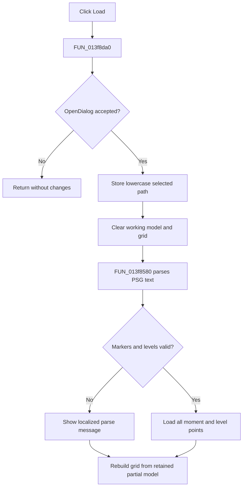

# &Load

> Analysis status: Evidence-backed source review complete.

## Control

| Property | Recovered value |
| --- | --- |
| Form | PsgForm |
| Component path | PsgForm.Load |
| Control class | TButton |
| Caption | &Load |
| Hint | Not present in the recovered resource. |
| Text | Not present in the recovered resource. |
| Handler name | LoadClick |
| Handler address | 013f8da0 |
| Graph node | `resource:dfm:PsgForm/PsgForm.Load` |
| Handler node | `function:013f8da0` |
| Graph layer | UI |

## What happens when clicked

`FUN_013f8da0` first executes the OpenDialog. Cancellation is a no-op. After acceptance, it reads the chosen file name, converts it to lowercase, and stores it at form field `+0x780`.

The handler then clears the current working sequence and AttributeGrid before it calls `FUN_013f8580`. The parser reads the pulse-generator text file, requires a `Default` marker, reads the first level, then reads repeated moment and level lines until the end marker. Recognized level values include the recovered zero-level literal, `High`, `Dontcare`, and `HighZ`.

After parsing, the handler rebuilds the row labels and editor bindings. A missing `Default` marker or invalid level displays a localized message. There is no rollback: the old sequence has already been cleared, so a parse error can leave an empty or partially loaded sequence. The repeat settings are not loaded from this file and remain unchanged.

## Click flow

## Handler evidence

- Source: [DecompiledSources/Tina16/functions/00000000013F8DA0__FUN_013f8da0.c](../../../DecompiledSources/Tina16/functions/00000000013F8DA0__FUN_013f8da0.c)
- Recovered role: Replace the working pulse sequence from a selected PSG text file.
- Current graph summary: Handles 1 Delphi UI event: PsgForm.Load.OnClick.
- Current graph behavior: Executes OpenDialog, stores a normalized path, clears the working model and grid, parses the file, and rebuilds grid labels and editors.
- Current graph evidence: The dialog VMT result guards all mutations. Accepted paths flow through `FUN_00724270`, lowercase conversion `FUN_0043e1a0`, model and grid clear helpers, `FUN_013f8580`, and the two rebuild helpers.
- Complexity: complex
- Distinct outgoing calls: 13

## Direct calls

- `function:00414480` — Delphi UnicodeString clear and finalization helper
- `function:00414ad0` — Delphi UnicodeString assignment helper
- `function:00416910` — FUN_00416910
- `function:0043e1a0` — converts the selected Unicode path to lowercase.
- `function:00724270` — returns the OpenDialog selected file name.
- `function:008483b0` — FUN_008483b0
- `function:00848a30` — FUN_00848a30
- `function:00848a70` — FUN_00848a70
- `function:00b0ae40` — FUN_00b0ae40
- `function:00b95290` — FUN_00b95290
- `function:013f76a0` — FUN_013f76a0
- `function:013f7aa0` — FUN_013f7aa0
- `function:013f8580` — parses the PSG text structure into the cleared working model and reports format errors.

## Resource evidence

- Kind: Not present in the recovered resource.
- Modal result: Not present in the recovered resource.
- Checked state: Not present in the recovered resource.
- List items: Not present in the recovered resource.
- Image reference: Not present in the recovered resource.
- Extracted glyph: None.

## Nearby label candidates

Nearby labels are layout candidates only. They are not proof of behavior.

- Rank 1: Repeat from:  at distance 110.

## Analysis limits

- File-open failures outside the recovered marker and level checks are handled by lower-level text I/O runtime code.
- The exact localized parse-message text and the level-zero literal are not recovered.
- The nearby **Repeat from:** label is not file-load evidence; the file parser does not update repeat state.
