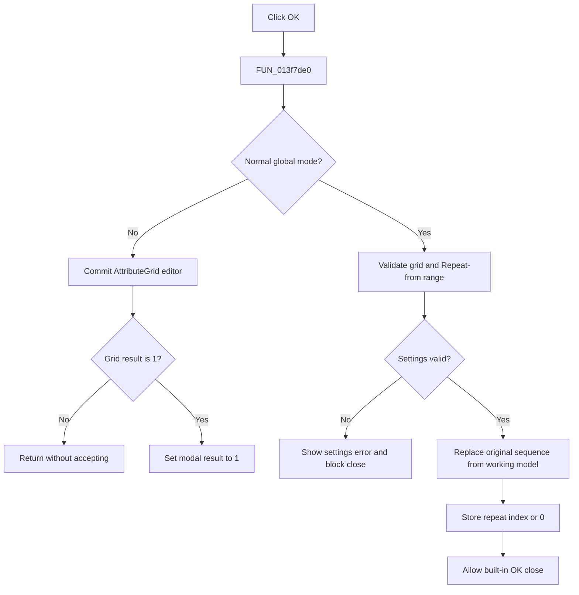

# OKBtn

> Analysis status: Evidence-backed source review complete.

## Control

| Property | Recovered value |
| --- | --- |
| Form | PsgForm |
| Component path | PsgForm.OKBtn |
| Control class | TBitBtn |
| Caption | Not present in the recovered resource. |
| Hint | Not present in the recovered resource. |
| Text | Not present in the recovered resource. |
| Handler name | OKBtnClick |
| Handler address | 013f7de0 |
| Graph node | `resource:dfm:PsgForm/PsgForm.OKBtn` |
| Handler node | `function:013f7de0` |
| Graph layer | UI |

## What happens when clicked

In the normal branch, `FUN_013f7de0` validates and commits the active AttributeGrid cell. It also reads **Repeat from** and requires that value to be no greater than the number of working sequence points. A failure sets error flag `+0x740` and displays **Error in pulse generator settings**. The `bkOK` close attempt then reaches FormCloseQuery, which keeps the form open when this flag is set and clears the flag for the next attempt.

When validation succeeds, the handler clears the original generator sequence, copies every point from working model `+0x750`, and applies the repeat index. An unchecked Repeat box stores index `0`; a checked box stores the validated Repeat-from value. The index is written both to the destination sequence and to the source generator object. The built-in OK action can then close the dialog.

An alternate branch is controlled by an unrecovered global mode flag. It asks the AttributeGrid to commit its current editor state and sets form modal result `1` only when grid result field `+0x638` is `1`. That branch does not run the normal sequence-copy path. No handler uses `Sender`.

## Click flow

## Handler evidence

- Source: [DecompiledSources/Tina16/functions/00000000013F7DE0__FUN_013f7de0.c](../../../DecompiledSources/Tina16/functions/00000000013F7DE0__FUN_013f7de0.c)
- Recovered role: Validate and apply the working pulse-generator sequence, or block dialog acceptance.
- Current graph summary: Handles 1 Delphi UI event: PsgForm.OKBtn.OnClick.
- Current graph behavior: In normal mode, validates the grid and repeat range, reports invalid settings, or replaces the original sequence and repeat index. An alternate global mode accepts only a grid result of `1`.
- Current graph evidence: The source branches on the global flag, uses `FUN_00b0a890` and Repeat-from versus model count for validation, calls `FUN_013f82b0` with the literal error text, copies through `FUN_01d3bb20`, and writes repeat fields. FormCloseQuery tests and clears the same error flag.
- Complexity: complex
- Distinct outgoing calls: 6

## Direct calls

- `function:00b0a890` — validates and commits the active AttributeGrid cell.
- `function:00b0a960` — performs the alternate-mode AttributeGrid editor commit and records its result.
- `function:00b95290` — clears the destination generator sequence before replacement.
- `function:00f04d50` — validates and returns the integer Repeat-from value.
- `function:013f82b0` — displays the recovered pulse-generator settings error.
- `function:01d3bb20` — copies all working points and repeat metadata into the destination sequence.

## Resource evidence

- Kind: bkOK
- Modal result: Not present in the recovered resource.
- Checked state: Not present in the recovered resource.
- List items: Not present in the recovered resource.
- Image reference: Not present in the recovered resource.
- Extracted glyph: None.

## Nearby label candidates

Nearby labels are layout candidates only. They are not proof of behavior.

- Rank 1: Repeat from:  at distance 269.

## Analysis limits

- The purpose and activation condition of the global alternate mode are not recovered.
- The resource `bkOK` value supports the close role. The validation, copy, error flag, and FormCloseQuery data flow prove the behavior.
- The handler validates Repeat-from against sequence count even when the normal branch later stores zero for an unchecked Repeat box.
