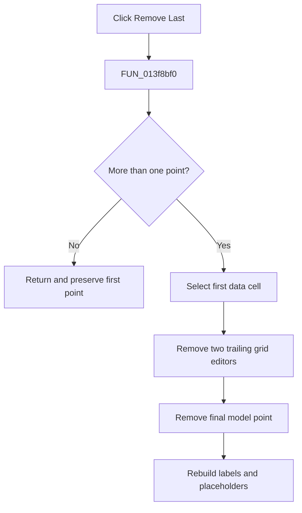

# &Remove Last

> Analysis status: Evidence-backed source review complete.

## Control

| Property | Recovered value |
| --- | --- |
| Form | PsgForm |
| Component path | PsgForm.RemoveLast |
| Control class | TBitBtn |
| Caption | &Remove Last |
| Hint | Not present in the recovered resource. |
| Text | Not present in the recovered resource. |
| Handler name | RemoveLastClick |
| Handler address | 013f8bf0 |
| Graph node | `resource:dfm:PsgForm/PsgForm.RemoveLast` |
| Handler node | `function:013f8bf0` |
| Graph layer | UI |

## What happens when clicked

`FUN_013f8bf0` removes the last working moment/level point only when the sequence contains more than one point. This guard preserves the required first point. A one-point sequence is a silent no-op.

For a valid removal, the handler moves the AttributeGrid selection to the first data cell, removes the last two editor rows, removes the final model record, rebuilds the alternating row labels, and restores localized placeholders after the new end of the sequence.

The handler does not adjust the repeat-from index. If that index now exceeds the shorter sequence, OK reports a settings error and does not apply the sequence.

## Click flow

## Handler evidence

- Source: [DecompiledSources/Tina16/functions/00000000013F8BF0__FUN_013f8bf0.c](../../../DecompiledSources/Tina16/functions/00000000013F8BF0__FUN_013f8bf0.c)
- Recovered role: Remove the last editable pulse point while preserving the first point.
- Current graph summary: Handles 1 Delphi UI event: PsgForm.RemoveLast.OnClick.
- Current graph behavior: Guards on model count greater than one, removes two AttributeGrid editor rows and one model record, then refreshes labels and placeholders.
- Current graph evidence: The source tests model count at `+0x10`, calls `FUN_00b0adf0` twice, calls `FUN_01d3bac0` once, and derives the new placeholder start from twice the remaining model count.
- Complexity: complex
- Distinct outgoing calls: 9

## Direct calls

- `function:00414480` — Delphi UnicodeString clear and finalization helper
- `function:008483b0` — FUN_008483b0
- `function:00848a30` — FUN_00848a30
- `function:0084e3e0` — FUN_0084e3e0
- `function:00b0adf0` — removes the last attached AttributeGrid editor row.
- `function:00b89270` — FUN_00b89270
- `function:00b8e520` — FUN_00b8e520
- `function:013f76a0` — rebuilds moment and level row labels for the remaining points.
- `function:01d3bac0` — removes the final record from the working sequence.

## Resource evidence

- Kind: Not present in the recovered resource.
- Modal result: Not present in the recovered resource.
- Checked state: Not present in the recovered resource.
- List items: Not present in the recovered resource.
- Image reference: Not present in the recovered resource.
- Extracted glyph: None.

## Nearby label candidates

Nearby labels are layout candidates only. They are not proof of behavior.

- Rank 1: Repeat from:  at distance 198.

## Analysis limits

- The handler does not clamp or clear the repeat-from index after removal.
- The distant **Repeat from:** label is not used as proof of the removal behavior.
