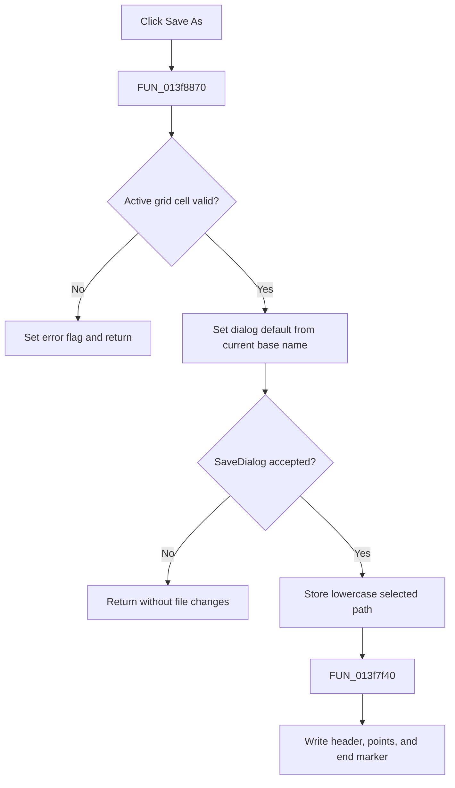

# Save &As...

> Analysis status: Evidence-backed source review complete.

## Control

| Property | Recovered value |
| --- | --- |
| Form | PsgForm |
| Component path | PsgForm.SaveAs |
| Control class | TButton |
| Caption | Save &As... |
| Hint | Not present in the recovered resource. |
| Text | Not present in the recovered resource. |
| Handler name | SaveAsClick |
| Handler address | 013f8870 |
| Graph node | `resource:dfm:PsgForm/PsgForm.SaveAs` |
| Handler node | `function:013f8870` |
| Graph layer | UI |

## What happens when clicked

`FUN_013f8870` first validates and commits the active AttributeGrid cell. If validation fails, it records the error flag at `+0x740` and returns without opening SaveDialog or writing a file.

For valid grid state, it uses the current PSG file's base name as the SaveDialog default. Cancellation leaves the stored file name and disk unchanged. After acceptance, the handler reads the chosen path, converts it to lowercase, stores it at `+0x780`, and calls `FUN_013f7f40`.

The writer emits the header `@ Pulse generator file`, a `Default` section with the first level, each later moment and level pair, and the final `.@ end of file` marker. The repeat-from setting is not part of this recovered file format. The handler has no local write-error recovery.

## Click flow

## Handler evidence

- Source: [DecompiledSources/Tina16/functions/00000000013F8870__FUN_013f8870.c](../../../DecompiledSources/Tina16/functions/00000000013F8870__FUN_013f8870.c)
- Recovered role: Save the validated working moment/level sequence to a selected PSG file.
- Current graph summary: Handles 1 Delphi UI event: PsgForm.SaveAs.OnClick.
- Current graph behavior: Guards on active-cell validation, runs SaveDialog, stores the normalized path, and serializes the working sequence in the recovered PSG text format.
- Current graph evidence: `FUN_00b0a890` controls the branch and error flag. The accepted dialog path flows through `FUN_00724270`, lowercase conversion, and `FUN_013f7f40`, whose literals and loop establish the file structure.
- Complexity: complex
- Distinct outgoing calls: 10

## Direct calls

- `function:00414480` — Delphi UnicodeString clear and finalization helper
- `function:00414560` — Delphi UnicodeString array finalization helper
- `function:00414ad0` — Delphi UnicodeString assignment helper
- `function:00416910` — FUN_00416910
- `function:0043e1a0` — converts the selected Unicode path to lowercase.
- `function:00441920` — extracts the current file's base name for the dialog default.
- `function:00724270` — returns the SaveDialog selected file name.
- `function:00724380` — sets the SaveDialog file-name property.
- `function:00b0a890` — validates and commits the active AttributeGrid cell.
- `function:013f7f40` — serializes the working model to the PSG text file.

## Resource evidence

- Kind: Not present in the recovered resource.
- Modal result: Not present in the recovered resource.
- Checked state: Not present in the recovered resource.
- List items: Not present in the recovered resource.
- Image reference: Not present in the recovered resource.
- Extracted glyph: None.

## Nearby label candidates

Nearby labels are layout candidates only. They are not proof of behavior.

- Rank 1: Repeat from:  at distance 77.

## Analysis limits

- Lower-level text I/O code handles file creation and write failures; this handler has no local recovery branch.
- The nearby **Repeat from:** label is not save evidence. The writer does not serialize repeat state.
