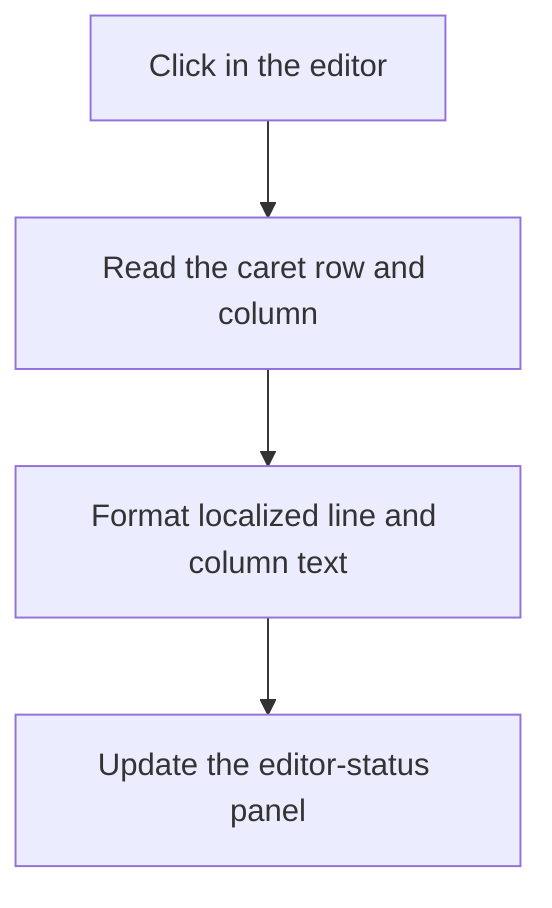

# Edit

> Analysis status: Recovered caret-position and status-panel update path reviewed.

## Control

| Property | Recovered value |
| --- | --- |
| Form | PyMainForm |
| Component path | PyMainForm.Panel1.Panel3.Panel5.Edit |
| Control class | TSynEdit |
| Caption | Not present in the recovered resource. |
| Hint | Not present in the recovered resource. |
| Text | Not present in the recovered resource. |
| Handler name | EditClick |
| Handler address | 0146f870 |
| Graph node | `resource:dfm:PyMainForm/PyMainForm.Panel1.Panel3.Panel5.Edit` |
| Handler node | `function:0146f870` |
| Graph layer | UI |

## What happens when clicked

A click in the main SynEdit control calls the shared caret-status helper. The helper reads the current editor column and row, formats them with two localized resource strings, and writes the result to the bottom status panel. The recovered initial panel caption is ` Line:1 Col:1`.

The click does not change the document text. The same helper is also used after other editor interactions, so the visible row and column can stay synchronized. There is no error branch or local catch.

## Click flow

## Handler evidence

- Source: [DecompiledSources/Tina16/functions/000000000146F870__FUN_0146f870.c](../../../DecompiledSources/Tina16/functions/000000000146F870__FUN_0146f870.c)
- Recovered role: Not present in the recovered resource.
- Current graph summary: Handles 1 Delphi UI event: PyMainForm.Panel1.Panel3.Panel5.Edit.OnClick.
- Current graph behavior: Not present in the recovered resource.
- Current graph evidence: Not present in the recovered resource.
- Complexity: simple
- Distinct outgoing calls: 1

## Direct calls

- `function:0146f8e0` — FUN_0146f8e0

## Resource evidence

- Kind: Not present in the recovered resource.
- Modal result: Not present in the recovered resource.
- Checked state: Not present in the recovered resource.
- List items: Not present in the recovered resource.
- Image reference: Not present in the recovered resource.
- Extracted glyph: None.

## Nearby label candidates

Nearby labels are layout candidates only. They are not proof of behavior.

- No same-parent label candidate is available.

## Analysis limits

- Do not infer behavior from the control class, caption, hint, glyph, or nearby label alone.
- The resource IDs for the localized line and column labels are known, but their original symbolic constant names are not recovered.
