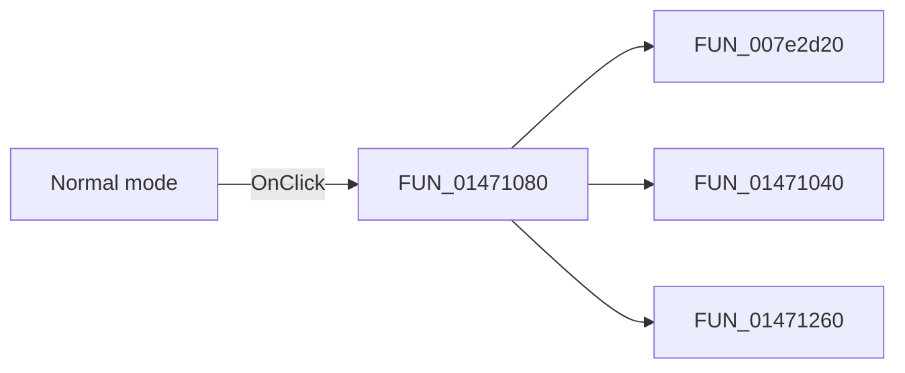

# Normal mode

> Analysis status: Pending individual source review.

## Control

| Property | Recovered value |
| --- | --- |
| Form | PyMainForm |
| Component path | PyMainForm.MainMenu.File1.mnRunApp.mnBackToMain |
| Control class | TMenuItem |
| Caption | Normal mode |
| Hint | Not present in the recovered resource. |
| Text | Not present in the recovered resource. |
| Handler name | mnBackToMainClick |
| Handler address | 01471080 |
| Graph node | `resource:dfm:PyMainForm/PyMainForm.MainMenu.File1.mnRunApp.mnBackToMain` |
| Handler node | `function:01471080` |
| Graph layer | UI |

## What happens when clicked

Pending individual analysis. An agent must read the recovered handler source and its relevant callees before it replaces this text.

## Click flow

## Handler evidence

- Source: [DecompiledSources/Tina16/functions/0000000001471080__FUN_01471080.c](../../../DecompiledSources/Tina16/functions/0000000001471080__FUN_01471080.c)
- Recovered role: Not present in the recovered resource.
- Current graph summary: Handles 1 Delphi UI event: PyMainForm.MainMenu.File1.mnRunApp.mnBackToMain.OnClick.
- Current graph behavior: Not present in the recovered resource.
- Current graph evidence: Not present in the recovered resource.
- Complexity: complex
- Distinct outgoing calls: 3

## Direct calls

- `function:007e2d20` — FUN_007e2d20
- `function:01471040` — FUN_01471040
- `function:01471260` — FUN_01471260

## Resource evidence

- Kind: Not present in the recovered resource.
- Modal result: Not present in the recovered resource.
- Checked state: Not present in the recovered resource.
- List items: Not present in the recovered resource.
- Image reference: Not present in the recovered resource.
- Extracted glyph: None.

## Nearby label candidates

Nearby labels are layout candidates only. They are not proof of behavior.

- No same-parent label candidate is available.

## Analysis limits

- Do not infer behavior from the control class, caption, hint, glyph, or nearby label alone.
- Do not replace the pending status until the handler source and relevant call path provide enough evidence.
