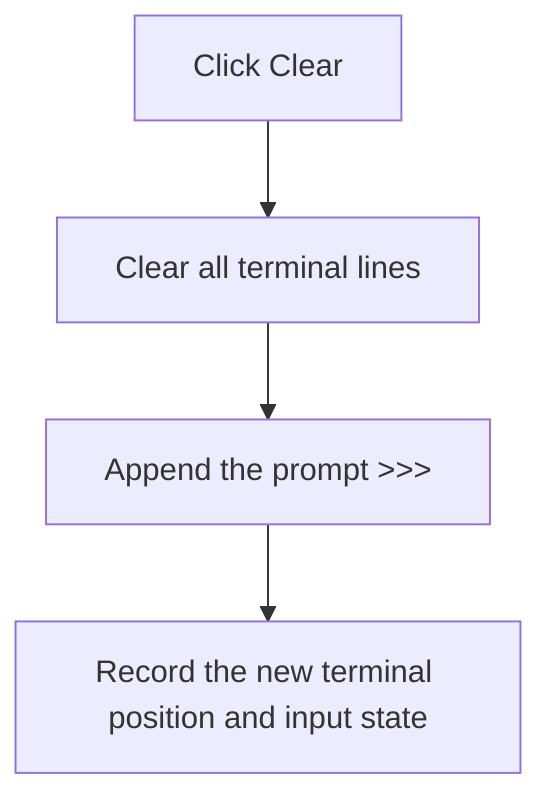

# Clear

> Analysis status: Recovered terminal clear and prompt-reset path reviewed.

## Control

| Property | Recovered value |
| --- | --- |
| Form | PyMainForm |
| Component path | PyMainForm.pmTerminal.mnClearTerminal |
| Control class | TMenuItem |
| Caption | Clear |
| Hint | Not present in the recovered resource. |
| Text | Not present in the recovered resource. |
| Handler name | mnClearTerminalClick |
| Handler address | 0146f140 |
| Graph node | `resource:dfm:PyMainForm/PyMainForm.pmTerminal.mnClearTerminal` |
| Handler node | `function:0146f140` |
| Graph layer | UI |

## What happens when clicked

The handler clears the terminal SynEdit line collection. It then runs the shared prompt-reset routine, which appends the exact prompt `>>>  `, records the resulting terminal position, and updates the shell's terminal-input state.

The click removes all visible terminal history without confirmation or undo. It does not clear the main editor or stop a running process. No local error branch or catch is present.

## Click flow

## Handler evidence

- Source: [DecompiledSources/Tina16/functions/000000000146F140__FUN_0146f140.c](../../../DecompiledSources/Tina16/functions/000000000146F140__FUN_0146f140.c)
- Recovered role: Not present in the recovered resource.
- Current graph summary: Handles 1 Delphi UI event: PyMainForm.pmTerminal.mnClearTerminal.OnClick.
- Current graph behavior: Not present in the recovered resource.
- Current graph evidence: Not present in the recovered resource.
- Complexity: simple
- Distinct outgoing calls: 1

## Direct calls

- `function:0146fd80` — FUN_0146fd80

## Resource evidence

- Kind: Not present in the recovered resource.
- Modal result: Not present in the recovered resource.
- Checked state: Not present in the recovered resource.
- List items: Not present in the recovered resource.
- Image reference: Not present in the recovered resource.
- Extracted glyph: None.

## Nearby label candidates

Nearby labels are layout candidates only. They are not proof of behavior.

- No same-parent label candidate is available.

## Analysis limits

- Do not infer behavior from the control class, caption, hint, glyph, or nearby label alone.
- The original Delphi names of the terminal-position state fields are not recovered.
