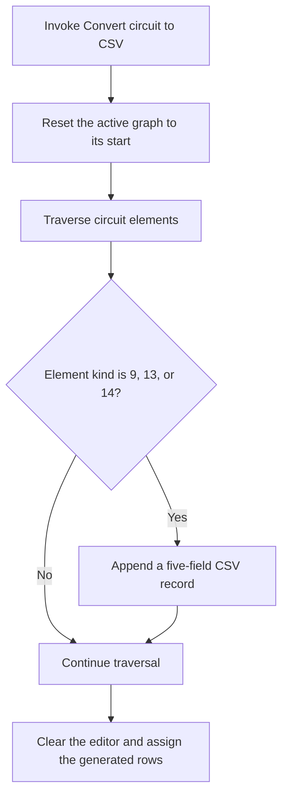

# Convert circuit to CSV...

> Analysis status: Recovered hidden menu, graph traversal, CSV construction, and editor replacement path reviewed.

## Control

| Property | Recovered value |
| --- | --- |
| Form | PyMainForm |
| Component path | PyMainForm.MainMenu.File1.mnConvertCircuit |
| Control class | TMenuItem |
| Caption | Convert circuit to CSV... |
| Hint | Not present in the recovered resource. |
| Text | Not present in the recovered resource. |
| Handler name | mnConvertCircuitClick |
| Handler address | 01471190 |
| Graph node | `resource:dfm:PyMainForm/PyMainForm.MainMenu.File1.mnConvertCircuit` |
| Handler node | `function:01471190` |
| Graph layer | UI |

## What happens when clicked

The recovered resource marks this menu item as disabled and hidden. If code invokes its handler, the handler resets the active circuit graph to its start, creates a temporary string list, and traverses the graph. The traversal accepts element kinds 9, 13, and 14. For each accepted element it builds one comma-separated record with the recovered format `%s,%s,%.4f,%s,%s`.

After the traversal, the handler clears the Python editor and assigns the generated list to it. A further graph-wide callback runs before the editor replacement. The click does not open `SaveDialog` and does not write a CSV file. The exact business names of the three accepted element kinds and the callback are not recovered.

## Click flow

## Handler evidence

- Source: [DecompiledSources/Tina16/functions/0000000001471190__FUN_01471190.c](../../../DecompiledSources/Tina16/functions/0000000001471190__FUN_01471190.c)
- Recovered role: Not present in the recovered resource.
- Current graph summary: Handles 1 Delphi UI event: PyMainForm.MainMenu.File1.mnConvertCircuit.OnClick.
- Current graph behavior: Not present in the recovered resource.
- Current graph evidence: Not present in the recovered resource.
- Complexity: complex
- Distinct outgoing calls: 6

## Direct calls

- `function:00410f20` — Nil-safe Delphi object destruction helper
- `function:004b6930` — FUN_004b6930
- `function:013b73b0` — FUN_013b73b0
- `function:01471150` — FUN_01471150
- `function:0199cfa0` — FUN_0199cfa0
- `function:019a4600` — FUN_019a4600

## Resource evidence

- Kind: Not present in the recovered resource.
- Modal result: Not present in the recovered resource.
- Checked state: Not present in the recovered resource.
- List items: Not present in the recovered resource.
- Image reference: Not present in the recovered resource.
- Extracted glyph: None.

## Nearby label candidates

Nearby labels are layout candidates only. They are not proof of behavior.

- No same-parent label candidate is available.

## Analysis limits

- Do not infer behavior from the control class, caption, hint, glyph, or nearby label alone.
- The resource keeps this command hidden and disabled. The recovered code does not prove a normal user path that enables it.
