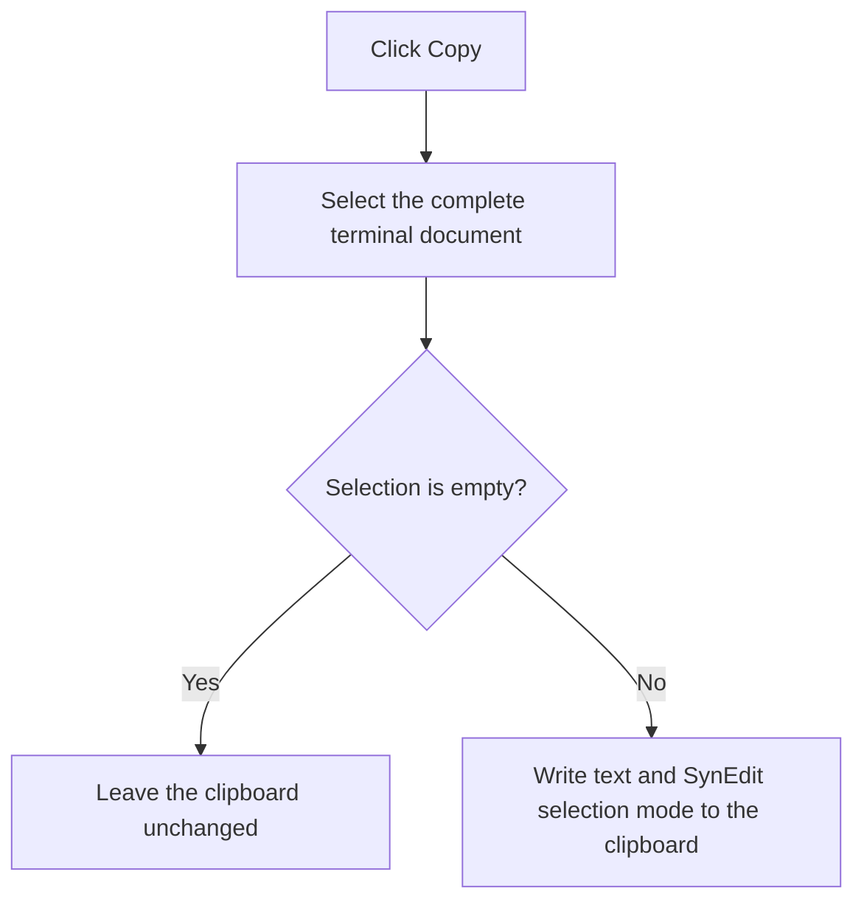

# Copy

> Analysis status: Recovered whole-terminal selection and clipboard-copy path reviewed.

## Control

| Property | Recovered value |
| --- | --- |
| Form | PyMainForm |
| Component path | PyMainForm.pmTerminal.mnCopyTerminal |
| Control class | TMenuItem |
| Caption | Copy |
| Hint | Not present in the recovered resource. |
| Text | Not present in the recovered resource. |
| Handler name | mnCopyTerminalClick |
| Handler address | 0146f180 |
| Graph node | `resource:dfm:PyMainForm/PyMainForm.pmTerminal.mnCopyTerminal` |
| Handler node | `function:0146f180` |
| Graph layer | UI |

## What happens when clicked

The handler first selects the complete terminal document, from line 1 column 1 through the final character. It then copies that selection to the clipboard. The copy helper writes standard clipboard text and the SynEdit-specific selection-mode payload.

This menu command therefore copies all terminal text, not only an existing partial selection. If the terminal is empty, the clipboard helper returns without writing. The full-document selection remains the active terminal selection after the operation.

## Click flow

## Handler evidence

- Source: [DecompiledSources/Tina16/functions/000000000146F180__FUN_0146f180.c](../../../DecompiledSources/Tina16/functions/000000000146F180__FUN_0146f180.c)
- Recovered role: Not present in the recovered resource.
- Current graph summary: Handles 1 Delphi UI event: PyMainForm.pmTerminal.mnCopyTerminal.OnClick.
- Current graph behavior: Not present in the recovered resource.
- Current graph evidence: Not present in the recovered resource.
- Complexity: moderate
- Distinct outgoing calls: 2

## Direct calls

- `function:00bf1d60` — FUN_00bf1d60
- `function:00bfa390` — FUN_00bfa390

## Resource evidence

- Kind: Not present in the recovered resource.
- Modal result: Not present in the recovered resource.
- Checked state: Not present in the recovered resource.
- List items: Not present in the recovered resource.
- Image reference: Not present in the recovered resource.
- Extracted glyph: None.

## Nearby label candidates

Nearby labels are layout candidates only. They are not proof of behavior.

- No same-parent label candidate is available.

## Analysis limits

- Do not infer behavior from the control class, caption, hint, glyph, or nearby label alone.
- Clipboard ownership and later clipboard-conversion behavior are handled by the VCL and operating system, outside this handler.
