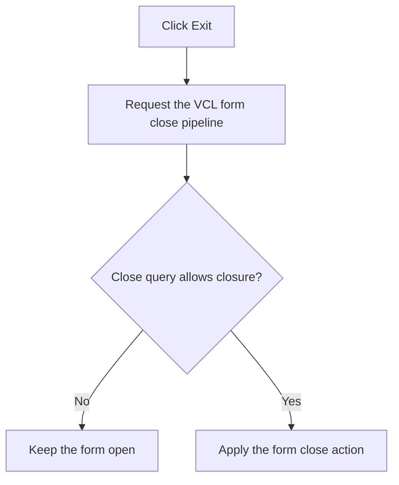

# Exit

> Analysis status: Recovered form-close delegation reviewed.

## Control

| Property | Recovered value |
| --- | --- |
| Form | PyMainForm |
| Component path | PyMainForm.MainMenu.File1.mnExit |
| Control class | TMenuItem |
| Caption | Exit |
| Hint | Not present in the recovered resource. |
| Text | Not present in the recovered resource. |
| Handler name | mnExitClick |
| Handler address | 0146f080 |
| Graph node | `resource:dfm:PyMainForm/PyMainForm.MainMenu.File1.mnExit` |
| Handler node | `function:0146f080` |
| Graph layer | UI |

## What happens when clicked

The handler delegates to the VCL form close pipeline. For a modeless form, that pipeline first runs the close query. A rejected query leaves the form open. An accepted close uses the close action selected by the form, such as hide, minimize, release, or main-form termination.

This handler does not save the editor automatically and does not show its own confirmation. Any prompt or veto must come from the form's close events or other VCL code.

## Click flow

## Handler evidence

- Source: [DecompiledSources/Tina16/functions/000000000146F080__FUN_0146f080.c](../../../DecompiledSources/Tina16/functions/000000000146F080__FUN_0146f080.c)
- Recovered role: Not present in the recovered resource.
- Current graph summary: Handles 1 Delphi UI event: PyMainForm.MainMenu.File1.mnExit.OnClick.
- Current graph behavior: Not present in the recovered resource.
- Current graph evidence: Not present in the recovered resource.
- Complexity: simple
- Distinct outgoing calls: 1

## Direct calls

- `function:0146f480` — FUN_0146f480

## Resource evidence

- Kind: Not present in the recovered resource.
- Modal result: Not present in the recovered resource.
- Checked state: Not present in the recovered resource.
- List items: Not present in the recovered resource.
- Image reference: Not present in the recovered resource.
- Extracted glyph: None.

## Nearby label candidates

Nearby labels are layout candidates only. They are not proof of behavior.

- No same-parent label candidate is available.

## Analysis limits

- Do not infer behavior from the control class, caption, hint, glyph, or nearby label alone.
- The recovered click handler does not expose which close action the form's OnClose handler selects at run time.
