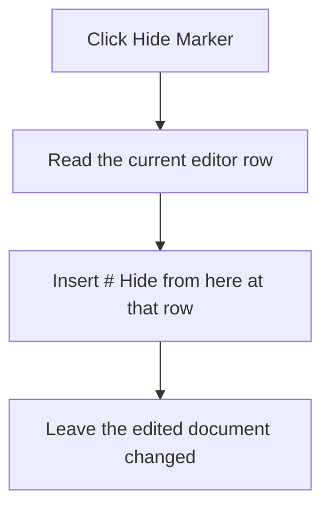

# Hide Marker

> Analysis status: Recovered editor-position and line-insertion path reviewed.

## Control

| Property | Recovered value |
| --- | --- |
| Form | PyMainForm |
| Component path | PyMainForm.MainMenu.Edit1.mnHideMarker |
| Control class | TMenuItem |
| Caption | Hide Marker |
| Hint | Not present in the recovered resource. |
| Text | Not present in the recovered resource. |
| Handler name | mnHideMarkerClick |
| Handler address | 0146f090 |
| Graph node | `resource:dfm:PyMainForm/PyMainForm.MainMenu.Edit1.mnHideMarker` |
| Handler node | `function:0146f090` |
| Graph layer | UI |

## What happens when clicked

The handler reads the current row from the main SynEdit control. It then inserts the exact text `# Hide from here` into the editor's line collection at that row. The click changes the Python source text only; it does not hide a VCL marker object or run the script.

The handler does not test the current line contents. Repeated clicks can insert repeated marker lines. The recovered function has no error dialog, confirmation, or local catch.

## Click flow

## Handler evidence

- Source: [DecompiledSources/Tina16/functions/000000000146F090__FUN_0146f090.c](../../../DecompiledSources/Tina16/functions/000000000146F090__FUN_0146f090.c)
- Recovered role: Not present in the recovered resource.
- Current graph summary: Handles 1 Delphi UI event: PyMainForm.MainMenu.Edit1.mnHideMarker.OnClick.
- Current graph behavior: Not present in the recovered resource.
- Current graph evidence: Not present in the recovered resource.
- Complexity: simple
- Distinct outgoing calls: 1

## Direct calls

- `function:00bfaa50` — FUN_00bfaa50

## Resource evidence

- Kind: Not present in the recovered resource.
- Modal result: Not present in the recovered resource.
- Checked state: Not present in the recovered resource.
- List items: Not present in the recovered resource.
- Image reference: Not present in the recovered resource.
- Extracted glyph: None.

## Nearby label candidates

Nearby labels are layout candidates only. They are not proof of behavior.

- No same-parent label candidate is available.

## Analysis limits

- Do not infer behavior from the control class, caption, hint, glyph, or nearby label alone.
- The original SynEdit method names are not recovered. The argument pattern and line-list object establish the insertion, but the exact row-base convention remains in the SynEdit implementation.
