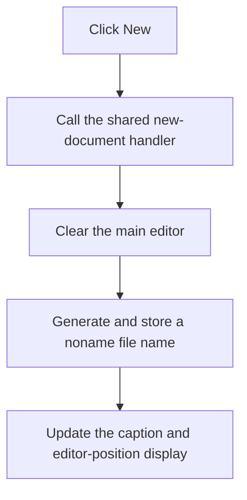

# New

> Analysis status: Recovered menu wrapper and shared new-document handler reviewed.

## Control

| Property | Recovered value |
| --- | --- |
| Form | PyMainForm |
| Component path | PyMainForm.MainMenu.File1.mnNew |
| Control class | TMenuItem |
| Caption | New |
| Hint | Not present in the recovered resource. |
| Text | Not present in the recovered resource. |
| Handler name | mnNewClick |
| Handler address | 0146f100 |
| Graph node | `resource:dfm:PyMainForm/PyMainForm.MainMenu.File1.mnNew` |
| Handler node | `function:0146f100` |
| Graph layer | UI |

## What happens when clicked

The menu handler calls the same new-document routine as the toolbar **New** button. That routine clears the main editor, creates a generated name from `noname%s` and the form's current extension field, stores the new name, updates the window caption, and refreshes the editor position display.

The routine does not ask to save current text before it clears the editor. It does not create a file on disk. The generated extension depends on the selected Python or nodal application mode.

## Click flow

## Handler evidence

- Source: [DecompiledSources/Tina16/functions/000000000146F100__FUN_0146f100.c](../../../DecompiledSources/Tina16/functions/000000000146F100__FUN_0146f100.c)
- Recovered role: Not present in the recovered resource.
- Current graph summary: Handles 1 Delphi UI event: PyMainForm.MainMenu.File1.mnNew.OnClick.
- Current graph behavior: Not present in the recovered resource.
- Current graph evidence: Not present in the recovered resource.
- Complexity: simple
- Distinct outgoing calls: 1

## Direct calls

- `function:0146f490` — Handles 1 Delphi UI event: PyMainForm.Panel1.Panel2.sbFileNew.OnClick.

## Resource evidence

- Kind: Not present in the recovered resource.
- Modal result: Not present in the recovered resource.
- Checked state: Not present in the recovered resource.
- List items: Not present in the recovered resource.
- Image reference: Not present in the recovered resource.
- Extracted glyph: None.

## Nearby label candidates

Nearby labels are layout candidates only. They are not proof of behavior.

- No same-parent label candidate is available.

## Analysis limits

- Do not infer behavior from the control class, caption, hint, glyph, or nearby label alone.
- The recovered source does not show a save-confirmation branch before the editor is cleared.
