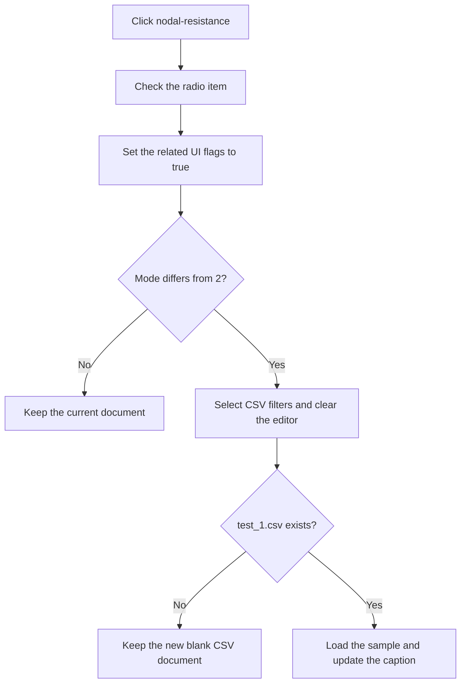

# nodal-resistance

> Analysis status: Recovered radio selection and nodal-resistance mode transition reviewed.

## Control

| Property | Recovered value |
| --- | --- |
| Form | PyMainForm |
| Component path | PyMainForm.MainMenu.File1.mnRunApp.mnNodalResistance |
| Control class | TMenuItem |
| Caption | nodal-resistance |
| Hint | Not present in the recovered resource. |
| Text | Not present in the recovered resource. |
| Handler name | mnNodalResistanceClick |
| Handler address | 014710b0 |
| Graph node | `resource:dfm:PyMainForm/PyMainForm.MainMenu.File1.mnRunApp.mnNodalResistance` |
| Handler node | `function:014710b0` |
| Graph layer | UI |

## What happens when clicked

The handler checks the **nodal-resistance** radio item, enables two related properties through a shared menu-state helper, and requests application mode 2. If mode 2 is already active, the file-loading part is a no-op.

For a real transition, the shared routine selects CSV-file filters and the `.csv` extension, clears the editor into a new blank document, and looks for `Examples\Python\nodal\test_1.csv`. It loads that sample and updates the current path and caption only when the file exists. The transition has no save prompt for the prior editor text.

## Click flow

## Handler evidence

- Source: [DecompiledSources/Tina16/functions/00000000014710B0__FUN_014710b0.c](../../../DecompiledSources/Tina16/functions/00000000014710B0__FUN_014710b0.c)
- Recovered role: Not present in the recovered resource.
- Current graph summary: Handles 1 Delphi UI event: PyMainForm.MainMenu.File1.mnRunApp.mnNodalResistance.OnClick.
- Current graph behavior: Not present in the recovered resource.
- Current graph evidence: Not present in the recovered resource.
- Complexity: complex
- Distinct outgoing calls: 3

## Direct calls

- `function:007e2d20` — FUN_007e2d20
- `function:01471040` — FUN_01471040
- `function:01471260` — FUN_01471260

## Resource evidence

- Kind: Not present in the recovered resource.
- Modal result: Not present in the recovered resource.
- Checked state: Not present in the recovered resource.
- List items: Not present in the recovered resource.
- Image reference: Not present in the recovered resource.
- Extracted glyph: None.

## Nearby label candidates

Nearby labels are layout candidates only. They are not proof of behavior.

- No same-parent label candidate is available.

## Analysis limits

- Do not infer behavior from the control class, caption, hint, glyph, or nearby label alone.
- The shared mode value 2 maps to the nodal-resistance executable later in the run path; the original Delphi enum name is not recovered.
