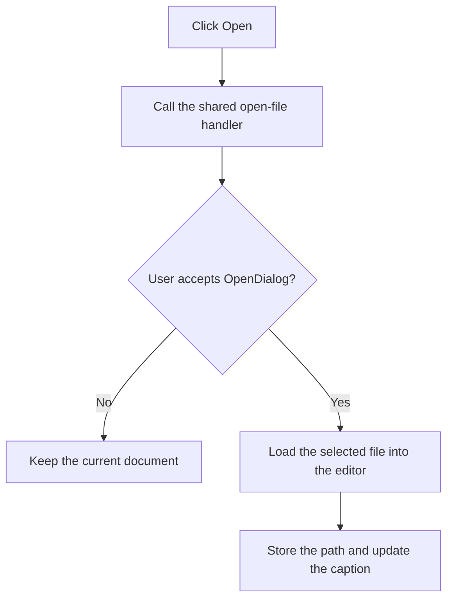

# Open

> Analysis status: Recovered menu wrapper, open dialog, load, and title-update path reviewed.

## Control

| Property | Recovered value |
| --- | --- |
| Form | PyMainForm |
| Component path | PyMainForm.MainMenu.File1.mnOpen |
| Control class | TMenuItem |
| Caption | Open |
| Hint | Not present in the recovered resource. |
| Text | Not present in the recovered resource. |
| Handler name | mnOpenClick |
| Handler address | 0146f110 |
| Graph node | `resource:dfm:PyMainForm/PyMainForm.MainMenu.File1.mnOpen` |
| Handler node | `function:0146f110` |
| Graph layer | UI |

## What happens when clicked

The menu handler calls the same routine as the toolbar **Open file** button. The routine opens `OpenDialog`. If the user cancels, it leaves the editor and current file name unchanged. If the user accepts, it loads the selected file into the main editor, stores that path as both the current and baseline file path, and updates the window caption.

The handler does not validate the file contents or catch a load failure locally.

## Click flow

## Handler evidence

- Source: [DecompiledSources/Tina16/functions/000000000146F110__FUN_0146f110.c](../../../DecompiledSources/Tina16/functions/000000000146F110__FUN_0146f110.c)
- Recovered role: Not present in the recovered resource.
- Current graph summary: Handles 1 Delphi UI event: PyMainForm.MainMenu.File1.mnOpen.OnClick.
- Current graph behavior: Not present in the recovered resource.
- Current graph evidence: Not present in the recovered resource.
- Complexity: simple
- Distinct outgoing calls: 1

## Direct calls

- `function:0146f570` — Handles 1 Delphi UI event: PyMainForm.Panel1.Panel2.sbFileOpen.OnClick.

## Resource evidence

- Kind: Not present in the recovered resource.
- Modal result: Not present in the recovered resource.
- Checked state: Not present in the recovered resource.
- List items: Not present in the recovered resource.
- Image reference: Not present in the recovered resource.
- Extracted glyph: None.

## Nearby label candidates

Nearby labels are layout candidates only. They are not proof of behavior.

- No same-parent label candidate is available.

## Analysis limits

- Do not infer behavior from the control class, caption, hint, glyph, or nearby label alone.
- File-format validation and load-error presentation are not present in the recovered handler.
