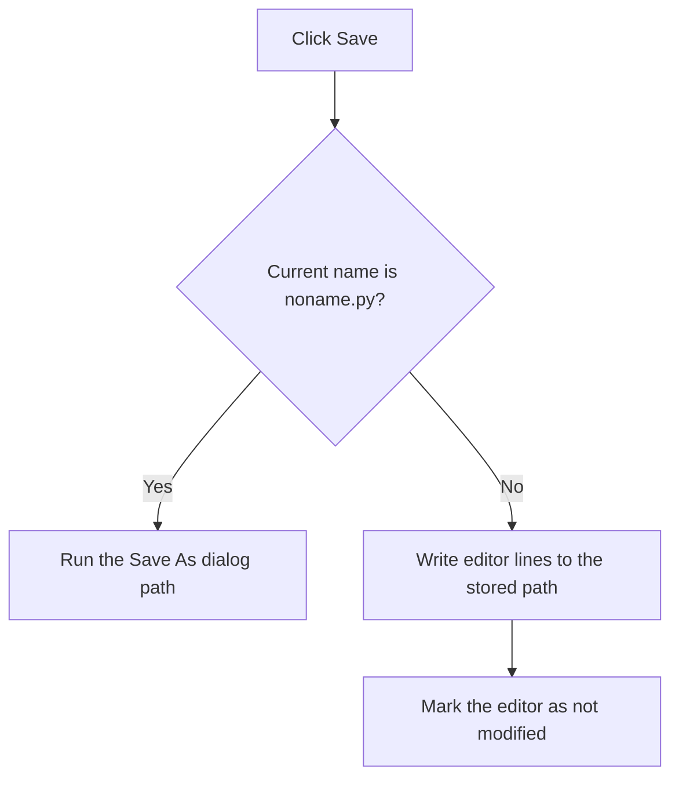

# Save

> Analysis status: Recovered save-name decision, file write, and modified-state update reviewed.

## Control

| Property | Recovered value |
| --- | --- |
| Form | PyMainForm |
| Component path | PyMainForm.MainMenu.File1.mnSave |
| Control class | TMenuItem |
| Caption | Save |
| Hint | Not present in the recovered resource. |
| Text | Not present in the recovered resource. |
| Handler name | mnSaveClick |
| Handler address | 0146f130 |
| Graph node | `resource:dfm:PyMainForm/PyMainForm.MainMenu.File1.mnSave` |
| Handler node | `function:0146f130` |
| Graph layer | UI |

## What happens when clicked

The handler compares the stored current name with the literal `noname.py`. For that name, it delegates to **Save As**. For every other name, it writes the main editor's line collection directly to the stored path and marks the editor as not modified.

There is no overwrite confirmation, path validation, retry, or local error catch in this handler. The literal comparison means that a generated non-Python name is not covered by the Save As branch.

## Click flow

## Handler evidence

- Source: [DecompiledSources/Tina16/functions/000000000146F130__FUN_0146f130.c](../../../DecompiledSources/Tina16/functions/000000000146F130__FUN_0146f130.c)
- Recovered role: Not present in the recovered resource.
- Current graph summary: Handles 1 Delphi UI event: PyMainForm.MainMenu.File1.mnSave.OnClick.
- Current graph behavior: Not present in the recovered resource.
- Current graph evidence: Not present in the recovered resource.
- Complexity: simple
- Distinct outgoing calls: 1

## Direct calls

- `function:0146f2f0` — FUN_0146f2f0

## Resource evidence

- Kind: Not present in the recovered resource.
- Modal result: Not present in the recovered resource.
- Checked state: Not present in the recovered resource.
- List items: Not present in the recovered resource.
- Image reference: Not present in the recovered resource.
- Extracted glyph: None.

## Nearby label candidates

Nearby labels are layout candidates only. They are not proof of behavior.

- No same-parent label candidate is available.

## Analysis limits

- Do not infer behavior from the control class, caption, hint, glyph, or nearby label alone.
- The recovered branch tests only the literal noname.py; behavior for a generated CSV name follows the direct-write branch.
