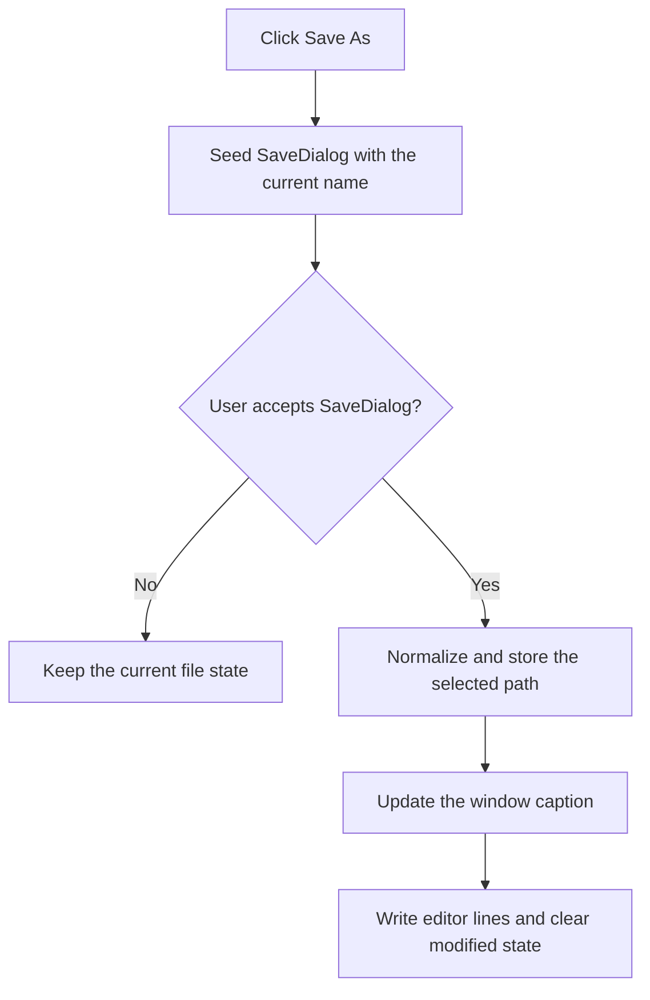

# Save As...

> Analysis status: Recovered save dialog, path normalization, file write, and title update reviewed.

## Control

| Property | Recovered value |
| --- | --- |
| Form | PyMainForm |
| Component path | PyMainForm.MainMenu.File1.mnSaveAs |
| Control class | TMenuItem |
| Caption | Save As... |
| Hint | Not present in the recovered resource. |
| Text | Not present in the recovered resource. |
| Handler name | mnSaveAsClick |
| Handler address | 0146f120 |
| Graph node | `resource:dfm:PyMainForm/PyMainForm.MainMenu.File1.mnSaveAs` |
| Handler node | `function:0146f120` |
| Graph layer | UI |

## What happens when clicked

The handler seeds `SaveDialog` with the stored current name and opens it. If the user cancels, it leaves the file and editor state unchanged. If the user accepts, it reads the selected path, applies the recovered path-normalization helper, stores the result as the current name, updates the window caption, writes the editor lines to that path, and marks the editor as not modified.

The recovered handler has no explicit overwrite check, retry, or local error catch.

## Click flow

## Handler evidence

- Source: [DecompiledSources/Tina16/functions/000000000146F120__FUN_0146f120.c](../../../DecompiledSources/Tina16/functions/000000000146F120__FUN_0146f120.c)
- Recovered role: Not present in the recovered resource.
- Current graph summary: Handles 1 Delphi UI event: PyMainForm.MainMenu.File1.mnSaveAs.OnClick.
- Current graph behavior: Not present in the recovered resource.
- Current graph evidence: Not present in the recovered resource.
- Complexity: simple
- Distinct outgoing calls: 1

## Direct calls

- `function:0146f360` — FUN_0146f360

## Resource evidence

- Kind: Not present in the recovered resource.
- Modal result: Not present in the recovered resource.
- Checked state: Not present in the recovered resource.
- List items: Not present in the recovered resource.
- Image reference: Not present in the recovered resource.
- Extracted glyph: None.

## Nearby label candidates

Nearby labels are layout candidates only. They are not proof of behavior.

- No same-parent label candidate is available.

## Analysis limits

- Do not infer behavior from the control class, caption, hint, glyph, or nearby label alone.
- The exact normalization performed by FUN_0043e1a0 is not recovered as a Delphi name.
