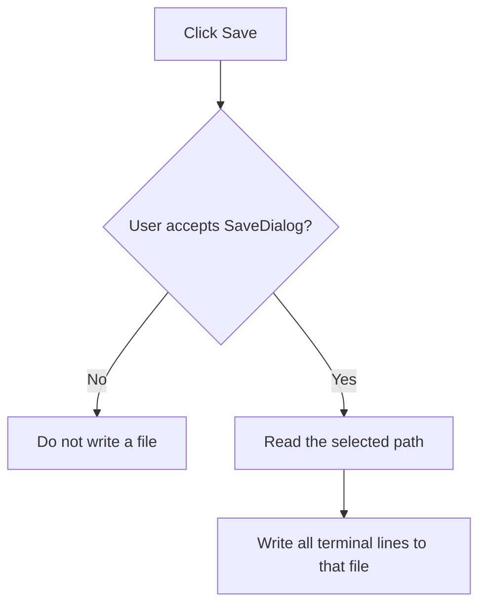

# Save

> Analysis status: Recovered save-dialog acceptance and terminal file-write path reviewed.

## Control

| Property | Recovered value |
| --- | --- |
| Form | PyMainForm |
| Component path | PyMainForm.pmTerminal.mnSaveTerminal |
| Control class | TMenuItem |
| Caption | Save |
| Hint | Not present in the recovered resource. |
| Text | Not present in the recovered resource. |
| Handler name | mnSaveTerminalClick |
| Handler address | 0146f1b0 |
| Graph node | `resource:dfm:PyMainForm/PyMainForm.pmTerminal.mnSaveTerminal` |
| Handler node | `function:0146f1b0` |
| Graph layer | UI |

## What happens when clicked

The handler opens `SaveDialog`. If the user cancels, it performs no write. If the user accepts, it reads the selected path and writes the terminal SynEdit line collection to that file. It then finalizes the temporary path string.

The click saves terminal history only. It does not save the main editor, clear the terminal, or change the Python document's current file name. No local overwrite check, retry, or error catch is present.

## Click flow

## Handler evidence

- Source: [DecompiledSources/Tina16/functions/000000000146F1B0__FUN_0146f1b0.c](../../../DecompiledSources/Tina16/functions/000000000146F1B0__FUN_0146f1b0.c)
- Recovered role: Not present in the recovered resource.
- Current graph summary: Handles 1 Delphi UI event: PyMainForm.pmTerminal.mnSaveTerminal.OnClick.
- Current graph behavior: Not present in the recovered resource.
- Current graph evidence: Not present in the recovered resource.
- Complexity: moderate
- Distinct outgoing calls: 2

## Direct calls

- `function:00414480` — Delphi UnicodeString clear and finalization helper
- `function:00724270` — FUN_00724270

## Resource evidence

- Kind: Not present in the recovered resource.
- Modal result: Not present in the recovered resource.
- Checked state: Not present in the recovered resource.
- List items: Not present in the recovered resource.
- Image reference: Not present in the recovered resource.
- Extracted glyph: None.

## Nearby label candidates

Nearby labels are layout candidates only. They are not proof of behavior.

- No same-parent label candidate is available.

## Analysis limits

- Do not infer behavior from the control class, caption, hint, glyph, or nearby label alone.
- The recovered resource does not specify a terminal-log file filter or default extension.
