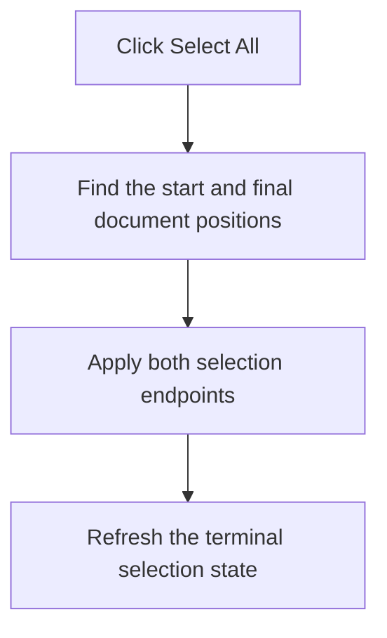

# Select All

> Analysis status: Recovered whole-terminal selection path reviewed.

## Control

| Property | Recovered value |
| --- | --- |
| Form | PyMainForm |
| Component path | PyMainForm.pmTerminal.mnSelectAllTerminal |
| Control class | TMenuItem |
| Caption | Select All |
| Hint | Not present in the recovered resource. |
| Text | Not present in the recovered resource. |
| Handler name | mnSelectAllTerminalClick |
| Handler address | 0146f250 |
| Graph node | `resource:dfm:PyMainForm/PyMainForm.pmTerminal.mnSelectAllTerminal` |
| Handler node | `function:0146f250` |
| Graph layer | UI |

## What happens when clicked

The handler selects the complete terminal document, from line 1 column 1 through the final character, and requests a selection-state update. It does not copy the text to the clipboard.

If the terminal has no text, the selection endpoints still resolve to the empty document and there is no visible error or message. The operation does not change terminal contents.

## Click flow

## Handler evidence

- Source: [DecompiledSources/Tina16/functions/000000000146F250__FUN_0146f250.c](../../../DecompiledSources/Tina16/functions/000000000146F250__FUN_0146f250.c)
- Recovered role: Not present in the recovered resource.
- Current graph summary: Handles 1 Delphi UI event: PyMainForm.pmTerminal.mnSelectAllTerminal.OnClick.
- Current graph behavior: Not present in the recovered resource.
- Current graph evidence: Not present in the recovered resource.
- Complexity: simple
- Distinct outgoing calls: 1

## Direct calls

- `function:00bfa390` — FUN_00bfa390

## Resource evidence

- Kind: Not present in the recovered resource.
- Modal result: Not present in the recovered resource.
- Checked state: Not present in the recovered resource.
- List items: Not present in the recovered resource.
- Image reference: Not present in the recovered resource.
- Extracted glyph: None.

## Nearby label candidates

Nearby labels are layout candidates only. They are not proof of behavior.

- No same-parent label candidate is available.

## Analysis limits

- Do not infer behavior from the control class, caption, hint, glyph, or nearby label alone.
- The original Delphi name of the recovered SynEdit select-all helper is not present.
