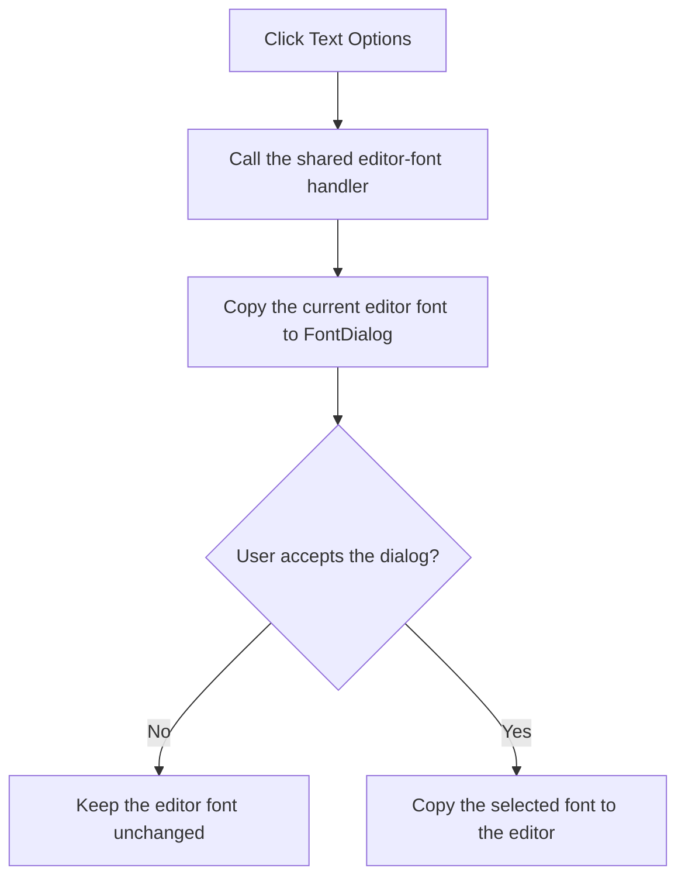

# Text Options

> Analysis status: Recovered wrapper and shared font-dialog handler reviewed.

## Control

| Property | Recovered value |
| --- | --- |
| Form | PyMainForm |
| Component path | PyMainForm.MainMenu.Edit1.mnTextOptions |
| Control class | TMenuItem |
| Caption | Text Options |
| Hint | Not present in the recovered resource. |
| Text | Not present in the recovered resource. |
| Handler name | mnTextOptionsClick |
| Handler address | 0146f270 |
| Graph node | `resource:dfm:PyMainForm/PyMainForm.MainMenu.Edit1.mnTextOptions` |
| Handler node | `function:0146f270` |
| Graph layer | UI |

## What happens when clicked

The menu handler delegates directly to the same handler as the **Set Editor Font** toolbar button. That handler copies the main editor's current font into `FontDialog` and opens the dialog. If the user accepts, it copies the selected font back to the editor. If the user cancels, the editor font stays unchanged.

The click changes editor presentation only. It does not change the document text, save the file, or change the terminal font. No local catch or retry path is present.

## Click flow

## Handler evidence

- Source: [DecompiledSources/Tina16/functions/000000000146F270__FUN_0146f270.c](../../../DecompiledSources/Tina16/functions/000000000146F270__FUN_0146f270.c)
- Recovered role: Not present in the recovered resource.
- Current graph summary: Handles 1 Delphi UI event: PyMainForm.MainMenu.Edit1.mnTextOptions.OnClick.
- Current graph behavior: Not present in the recovered resource.
- Current graph evidence: Not present in the recovered resource.
- Complexity: simple
- Distinct outgoing calls: 1

## Direct calls

- `function:01470c00` — Handles 1 Delphi UI event: PyMainForm.Panel1.Panel2.sbSetFont.OnClick.

## Resource evidence

- Kind: Not present in the recovered resource.
- Modal result: Not present in the recovered resource.
- Checked state: Not present in the recovered resource.
- List items: Not present in the recovered resource.
- Image reference: Not present in the recovered resource.
- Extracted glyph: None.

## Nearby label candidates

Nearby labels are layout candidates only. They are not proof of behavior.

- No same-parent label candidate is available.

## Analysis limits

- Do not infer behavior from the control class, caption, hint, glyph, or nearby label alone.
- The recovered code does not show whether the selected font persists after this form closes.
