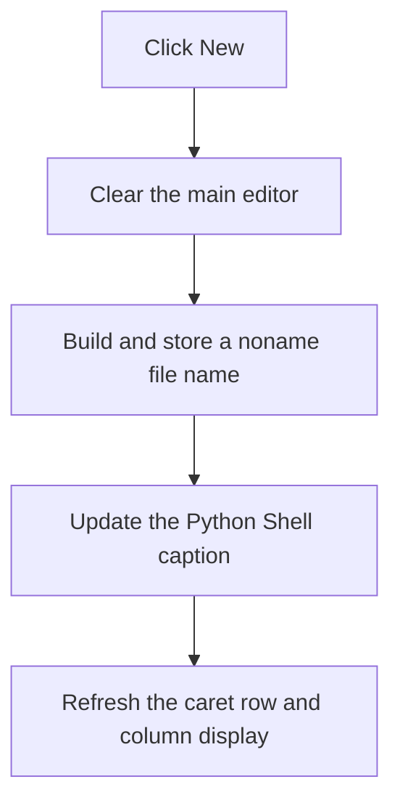

# New

> Analysis status: Recovered editor clear, generated-name, title, and caret-status path reviewed.

## Control

| Property | Recovered value |
| --- | --- |
| Form | PyMainForm |
| Component path | PyMainForm.Panel1.Panel2.sbFileNew |
| Control class | TSpeedButton |
| Caption | Not present in the recovered resource. |
| Hint | New |
| Text | Not present in the recovered resource. |
| Handler name | sbFileNewClick |
| Handler address | 0146f490 |
| Graph node | `resource:dfm:PyMainForm/PyMainForm.Panel1.Panel2.sbFileNew` |
| Handler node | `function:0146f490` |
| Graph layer | UI |

## What happens when clicked

The handler clears the main editor. It builds a generated name from `noname%s` and the form's current extension field, stores that name, updates the window caption to include it, and refreshes the editor-position panel from the current caret row and column.

The click does not create a disk file and does not ask to save the previous editor text. The selected application mode controls whether the generated extension is Python or CSV.

## Click flow

## Handler evidence

- Source: [DecompiledSources/Tina16/functions/000000000146F490__FUN_0146f490.c](../../../DecompiledSources/Tina16/functions/000000000146F490__FUN_0146f490.c)
- Recovered role: Not present in the recovered resource.
- Current graph summary: Handles 1 Delphi UI event: PyMainForm.Panel1.Panel2.sbFileNew.OnClick.
- Current graph behavior: Not present in the recovered resource.
- Current graph evidence: Not present in the recovered resource.
- Complexity: complex
- Distinct outgoing calls: 5

## Direct calls

- `function:00414480` — Delphi UnicodeString clear and finalization helper
- `function:00414ad0` — Delphi UnicodeString assignment helper
- `function:00442f70` — FUN_00442f70
- `function:0146f8e0` — FUN_0146f8e0
- `function:0146fe10` — FUN_0146fe10

## Resource evidence

- Kind: Not present in the recovered resource.
- Modal result: Not present in the recovered resource.
- Checked state: Not present in the recovered resource.
- List items: Not present in the recovered resource.
- Image reference: Not present in the recovered resource.
- Extracted glyph: [`0313_PyMainForm_PyMainForm_Panel1_Panel2_sbFileNew_Glyph_Data.png`](../../../glyph/0313_PyMainForm_PyMainForm_Panel1_Panel2_sbFileNew_Glyph_Data.png)

## Nearby label candidates

Nearby labels are layout candidates only. They are not proof of behavior.

- No same-parent label candidate is available.

## Analysis limits

- Do not infer behavior from the control class, caption, hint, glyph, or nearby label alone.
- The recovered source does not contain a save-confirmation branch before the editor is cleared.
