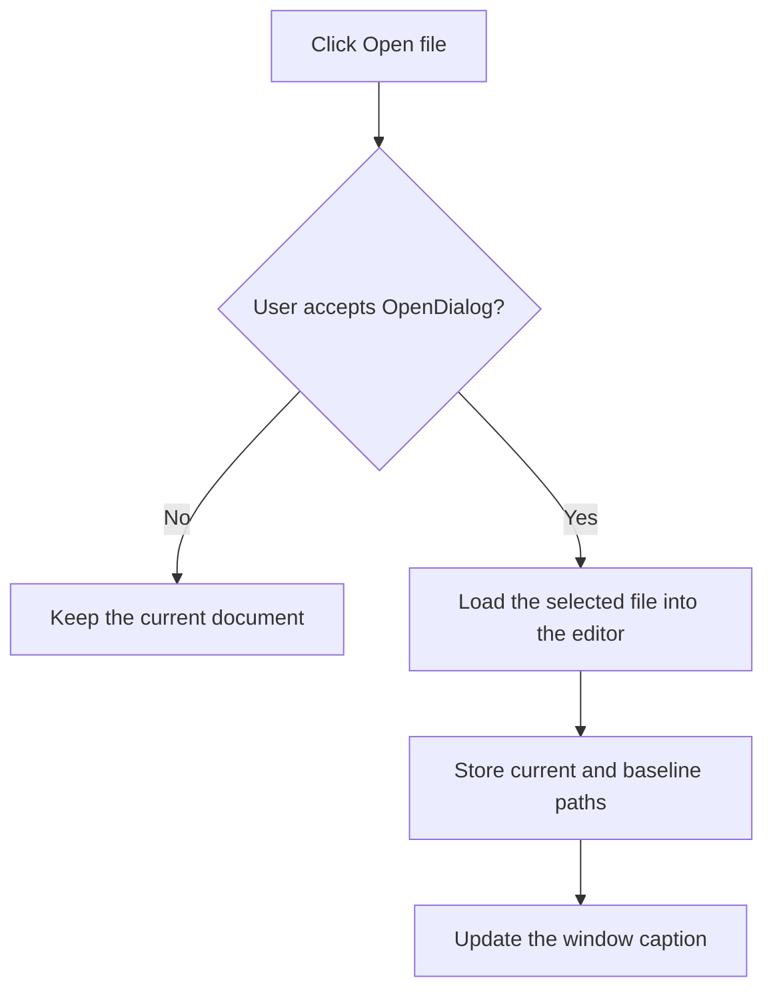

# Open file

> Analysis status: Recovered open dialog, editor load, stored paths, and title update reviewed.

## Control

| Property | Recovered value |
| --- | --- |
| Form | PyMainForm |
| Component path | PyMainForm.Panel1.Panel2.sbFileOpen |
| Control class | TSpeedButton |
| Caption | Not present in the recovered resource. |
| Hint | Open file |
| Text | Not present in the recovered resource. |
| Handler name | sbOpenClick |
| Handler address | 0146f570 |
| Graph node | `resource:dfm:PyMainForm/PyMainForm.Panel1.Panel2.sbFileOpen` |
| Handler node | `function:0146f570` |
| Graph layer | UI |

## What happens when clicked

The handler opens `OpenDialog`. Cancel is a no-op. On acceptance, it loads the selected file into the main editor, stores the selected path as both the current and baseline path fields, and updates the window caption with the current file name.

The handler does not validate Python or CSV syntax. It has no local catch, retry, or custom load-error branch.

## Click flow

## Handler evidence

- Source: [DecompiledSources/Tina16/functions/000000000146F570__FUN_0146f570.c](../../../DecompiledSources/Tina16/functions/000000000146F570__FUN_0146f570.c)
- Recovered role: Not present in the recovered resource.
- Current graph summary: Handles 1 Delphi UI event: PyMainForm.Panel1.Panel2.sbFileOpen.OnClick.
- Current graph behavior: Not present in the recovered resource.
- Current graph evidence: Not present in the recovered resource.
- Complexity: complex
- Distinct outgoing calls: 4

## Direct calls

- `function:00414560` — Delphi UnicodeString array finalization helper
- `function:00414ad0` — Delphi UnicodeString assignment helper
- `function:00724270` — FUN_00724270
- `function:0146fe10` — FUN_0146fe10

## Resource evidence

- Kind: Not present in the recovered resource.
- Modal result: Not present in the recovered resource.
- Checked state: Not present in the recovered resource.
- List items: Not present in the recovered resource.
- Image reference: Not present in the recovered resource.
- Extracted glyph: [`0311_PyMainForm_PyMainForm_Panel1_Panel2_sbFileOpen_Glyph_Data.png`](../../../glyph/0311_PyMainForm_PyMainForm_Panel1_Panel2_sbFileOpen_Glyph_Data.png)

## Nearby label candidates

Nearby labels are layout candidates only. They are not proof of behavior.

- No same-parent label candidate is available.

## Analysis limits

- Do not infer behavior from the control class, caption, hint, glyph, or nearby label alone.
- The original Delphi names of form path fields +0x7f0 and +0x7e8 are not recovered.
